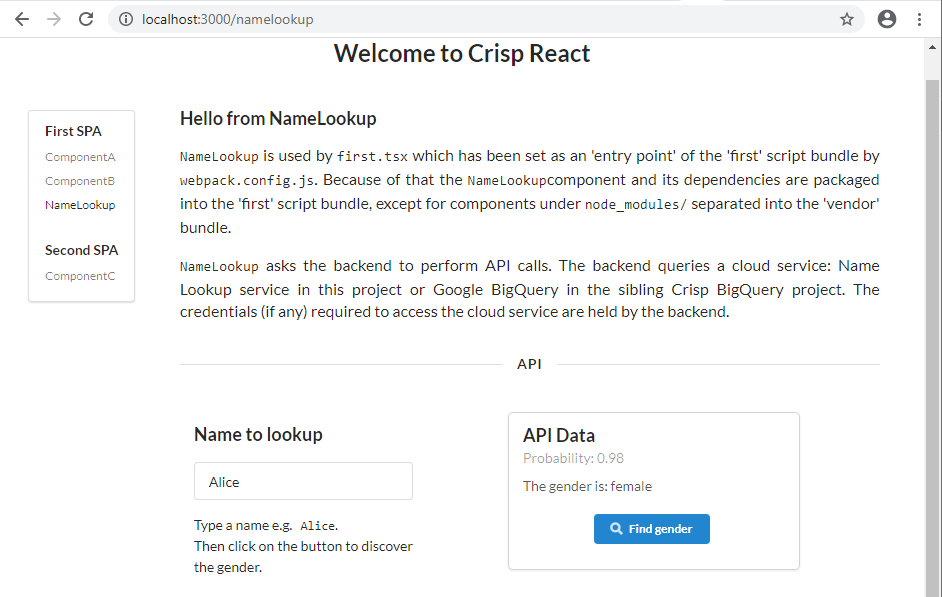
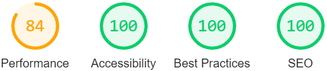
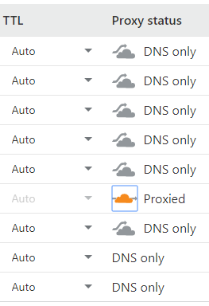
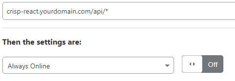
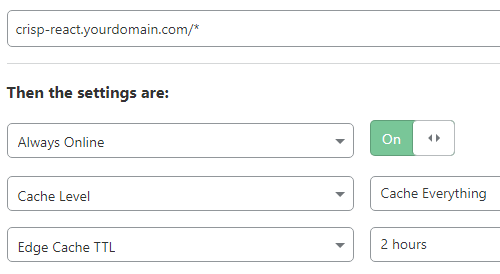

<div align="center">
  <a href="https://crisp-react.winwiz1.com">
    
  </a>
  <br />
  <br />
</div>
<br />
<div align="center">
  
  
  
  
  
</div>

## Project Highlights
Crisp React can optionally split a monolithic React app into multiple Single Page Applications (SPAs) and selectively prerender the landing/index page of any SPA at the build time. This innovative flexibility can offer the best performance for many websites, more about it later. Yet it doesn't come at the price of complicating the solution which remains as simple as a React application could possibly be.

For example, the Router is arguably one of the most important SPA components because it drives the application by controlling its page switching. Crisp React doesn't use a custom Router, in each SPA the routing is managed by a separate instance of [React Router](https://reactrouter.com/) which is the de facto standard for React SPAs.

The value offered by Crisp React is not limited to performance. On the one hand, the value comes from what this solution doesn't bring about. There is no need to learn a framework, depend on it and use non-portable programming constructs in the React components you write, therefore no vendor lock-in. On the other hand, the list of useful features includes:
### SEO and SPA
On the contrary to popular belief that SEO requires SSR, this solution innovatively demonstrates how to get all SPA pages indexed by Google and specific, targeted SEO advice on how to achieve indexing is provided.

Sample websites:
* [Demo - Full stack](https://crisp-react.winwiz1.com). Automated build performed by Heroku from this  repository. All pages, including internal SPA pages, are noted in [sitemap](https://crisp-react.winwiz1.com/sitemap.xml) and [indexed](https://www.google.com/search?q=site%3Acrisp-react.winwiz1.com) by Google.
* [Demo - Jamstack](https://jamstack.winwiz1.com). Automated build performed by Cloudflare Pages from the same repository. All pages, including internal SPA pages, are mentioned in [sitemap](https://jamstack.winwiz1.com/sitemap.xml) and [indexed](https://www.google.com/search?q=site%3Ajamstack.winwiz1.com) by Google.
* [Production](https://virusquery.com). Based on Crisp React. All pages, including internal SPA pages, are noted in [sitemap](https://virusquery.com/sitemap.xml) and [indexed](https://www.google.com/search?q=site%3Avirusquery.com) by Google.

If the websites built and deployed automatically from GitHub repository are indexed, then there is no any inherent reason why your website, built using the same boilerplate, won't be indexed as well provided you keep following the [guidelines](https://developers.google.com/search/docs/advanced/javascript/javascript-seo-basics) this solution already adheres to. No matter which build option, Jamstack or full stack, you choose.

Google has spent considerable effort on educating developers about [Structured Data](https://developers.google.com/search/docs/advanced/structured-data/intro-structured-data) and made the [Rich Results Test](https://search.google.com/test/rich-results) tool available online. Again, this solution assists by helping to embed one or several pieces of such data (static or dynamic) into the `<head>` element of your website. The existing sample data can be used as a placeholder and replaced with your own data.

More details are available from the [SEO](#seo) section.
### Performance
The performance is achieved by:
* Splitting React app into multiple SPAs, each rendered by its own and smaller script bundle that can be downloaded faster.
* The landing/index page of any SPA can be prerendered at the build time to let a browser build the DOM without waiting for the bundle to be downloaded, parsed and executed.
* Standard Webpack techniques such as tree shaking, script bundle minification and compression.
* Long term caching of script bundles in the browser cache.
    > To achieve smooth rollout of versioning changes, only bundles are cached client-side. HTML files are not. The risk of old bundles getting stuck in the cache is eliminated by bundle fingerprinting (its name includes the build hash).

This topic is covered further in the [separate section](docs/benchmarks/PERFORMANCE.md#performance). It provides more insight into the performance related issues along with benchmarking results.
### Full Stack and Jamstack Builds
The solution provides full stack deployments with several cloud vendors yet again avoids vendor lock-in by reusing the same Docker container. This is complimented by Jamstack deployments that aim for simplicity and speedy production release. All deployments achieve high test scores from reputable online testing tools like [web.dev/measure](https://web.dev/measure) and [webpagetest.org](https://webpagetest.org).

<table width=100%>
  <tr>
    <th width=15%>Build option</th>
    <th width=35%>What it does</th>
    <th width=50%>Sample builds</th>
  </tr>
  <tr>
    <td>Full stack</td>
    <td>Builds React app and backend.  The latter serves static app files and API responses to end users.<br/> Although in many production deployments the static files would be served to a CDN instead.<br/>Having one server instead of two (one for frontend, another for backend) reduces the attack surface of the deployment, brings down its costs, complexity and delivers other benefits like CORS avoidance.</td>
    <td><ul><li>Google Cloud Run: Click on the button provided in the relevant section.  Then wait until the build finishes in the cloud and access the website. Fast :clock2: and simple build.</li><li>Heroku: Execute several commands from your Terminal and get the website running. Simple build but takes :clock5: a while. Free :coffee: deployment option.</li><li>Google Compute Engine: More complex :scroll: and potentially very secure :lock: deployment with a series of commands to execute and without any software that needs to be installed.</li></ul></td>
  </tr>
  <tr>
    <td>Jamstack</td>
     <td>Builds the React app only. The build artifacts are served to end users by the webserver supplied by a Jamstack vendor.<br/>Since the demo project has no backend, the API calls go directly to the cloud service.<br/>In production the API calls could target endpoints implemented by AWS API Gateway or similar infrastructure.</td>
      <td><ul><li>Cloudflare Pages: Provide just a few simple pieces of data using the configuration screen presented by Pages. Then get a website built and deployed in the cloud. Fast :clock2: and simple build with free :coffee: deployment option.</li><li>AWS S3: More complex :scroll: deployment. Build the website locally and copy build artifacts to a cloud bucket while completing a series of manual deployment steps.</li></ul></td>
  </tr>
</table>

### Code Splitting.
Based on the ability to optionally split your React application into multiple Single Page Applications (SPA). For example, one SPA can offer an introductory set of screens for the first-time user or handle login. Another SPA could implement the rest of the application, except for Auditing or Reporting that can be catered for by yet another SPA. This approach would be beneficial for medium-to-large React applications and can be combined with other code splitting techniques - see [Q & A](docs/Q&A.md#dynamic-imports) section.
### Simplicity
Smaller codebase and slim building machinery translate into less maintenance burden and easy troubleshooting. The other (e.g. development) side of this coin is also bright: Adding third-party libraries will less likely cause incompatibility with existing software. Simlpicity coupled with absence of non-portable properties, opinionated data fetching hooks etc. means there is less room for the incompatibility issues to develop, less potential friction points.

The amount of code that any Github repository contains can be measured using the link: `https://img.shields.io/github/languages/code-size/<owner-name>/<repo-name>`. For Crisp React, the amount of code is currently around 135 kB and is shown by the code size badge. The client and the server subprojects each contribute ~50% of the codebase. The latter is used in full stack builds only.
### CSS
The following CSS handling approaches can be used:

| Approach | Advantages | Disadvantages
|:---:|:---|:---|
|Plain CSS|Simplicity.<br/>Performance.|Several React components can have rules with the same class selector names. It creates collisions that need to be tracked manually.|
|CSS Modules|Performance.<br/>Name collisions resolved automatically.<br/>Support for rule reuse via composition.|Rule duplication (if undetected) increases the size of the resulting stylesheet.|
|LESS|Rich functionality.|Learning curve exists.<br/>Potential for overengineering.
|CSS-in-JS|Productivity.<br/>Learning curve minimal with basic CSS knowledge.<br/>Helps to create self-contained components.<br/>CSS handling logic could be sophisticated, depend on run-time data etc.|Script dependency results in loading delays.<br/> If used unwisely (e.g. for a rule that affects page layout), can trigger Cumulative Layout Shift (CLS). The CLS could be visible to users as a sudden and unpleasant page movement or layout adjustment.<br/>Loss of JSX code portability.<br/>The chosen library, namely Emotion, is not Atomic (see the [review](https://github.com/andreipfeiffer/css-in-js#11-atomic-css)), so rule duplication is an issue.|

The CSS handling techniques can be combined in order to maximise advantages of each approach while trying to minimise its downside. More details are available under the [CSS Handling](https://github.com/winwiz1/crisp-react#css-handling) heading.
### Enterprise Options
The options are not implemented to keep the codebase slim but can be added easily to include:
* Intellectual Property protection,
* RBAC augmentation,
* Website partitioning for development in parallel by several teams or developers.

 The first two options are [based](docs/WhenToUse.md#case-enterprise-requirements) on making the script bundle download conditional. This functionality can be added for both Jamstack and full stack builds by utilising solutions like [Auth0](https://auth0.com)  or [PassportJS](https://www.npmjs.com/package/passport). The last option uses a SPA as a unit of planning, development and acceptance.
### Seamless Debugging.
Debug a minified/obfuscated, compressed production bundle and put breakpoints in its TypeScript code using both VS Code and Chrome DevTools. Development build debugging: put breakpoints in the client and backend code and debug both simultaneously using a single instance of VS Code. The specific instructions are available under the [Scenarios](#scenarios) heading.

---
[The addendum](docs/WhenToUse.md#when-to-use) lists a few cases that answer the question “When use this solution”. It also addresses the opposite e.g. “When not to use it”.

## Table of Contents
- [Getting Started](#getting-started) 
- [Features](#features)
  - [SPA Configuration](#spa-configuration)
  - [CSS Handling](#css-handling)
    - [Plain CSS](#plain-css)
    - [CSS Modules](#css-modules)
    - [LESS](#less)
    - [CSS-in-JS](#css-in-js)
- [Testing](#testing)
- [Usage - Jamstack](#usage---jamstack)
  - [Cloudflare Pages](#cloudflare-pages)
  - [AWS S3](#aws-s3)
- [Usage - Full Stack](#usage---full-stack)
  - [Docker](#docker)
  - [Heroku](#heroku)
  - [Google Compute Engine](#google-compute-engine)
  - [Cloud Run](#cloud-run)
- [Scenarios](#scenarios)
  - [Client Usage Scenarios](docs/Scenarios.md#client-usage-scenarios)
  - [Backend Usage Scenarios](docs/Scenarios.md#backend-usage-scenarios)
- [Custom Domain and CDN](#custom-domain-and-cdn)
- [SEO](#seo)
  - [Goals](#goals)
  - [Prerequisites](#prerequisites)
  - [Groundwork](#groundwork)
  - [Requesting To Be Indexed](#requesting-to-be-indexed)
  - [Structured Data](#structured-data)
- [What's Next](#whats-next)
- [Pitfall Avoidance](#pitfall-avoidance)
- [Q & A](#q--a)
- [License](#license)

## Getting Started
### Full Stack
Install `yarn` if not already installed: `npm install yarn -g`

<div>
  <details>
    <summary><strong>With VS Code</strong></summary>
    <br />
    Prerequisites: Chrome and VS Code with 'Debugger for Chrome' extension.<br/><br/>
    <ul>
      <li>Clone the <code>crisp-react</code> repository:<br/>
        <br/>
        <code>git clone https://github.com/winwiz1/crisp-react.git</code><br/>
        <code>cd crisp-react</code><br/>
        <br/>
      </li>
      <li>Install dependencies:
        <p>
          <code>yarn install</code>
        </p>
      </li>
      <li>Open the workspace file in VS Code:
        <p>
          <code>code ./crisp-react.code-workspace</code>
        </p>
      </li>
      <li>Start the debugging configuration <code>'Debug Client and Backend (workspace)'</code>.</li>
      <br/>
      <li>Wait until an instance of Chrome starts. You should see the Overview page:
        <p>
          
        </p>
        <br/>
      </li>
      <li>Choose the <code>NameLookup</code> component from the menu. You should see its page:
        <p>
          
        </p>
        <br/>
      </li>
      <li>Stop the running debugging configuration (use the 'Stop' button on VS Code Debugging toolbar two times or press <code>Control+F5</code> twice).</li>
    </ul>
  </details>
</div>
<div>
  <details>
    <summary><strong>Without VS Code</strong></summary>
    <br />
    After executing the following commands:<br/>
	<br/>
    <code>  git clone https://github.com/winwiz1/crisp-react.git</code><br/>
    <code>  cd crisp-react</code><br/>
    <code>  yarn install && yarn start:prod</code><br/>
    <br/>
    you will have a running instance of backend (e.g. Express) serving the newly built React app that can be seen by pointing a browser to <code>localhost:3000</code>.<br/>
    Terminate the backend by pressing <code>Control+C</code>.
  </details>
</div>

The section can be concluded by optionally renaming the solution. Rename the top-level directory from `crisp-react` to `your-project` and set the `SPAs.appTitle` variable in the [`spa.config.js`](https://github.com/winwiz1/crisp-react/blob/master/client/config/spa.config.js) file accordingly. Ignore the rest of the file for a moment, it's covered in depth in the [SPA Configuration](#spa-configuration) section.
### Jamstack
Use the configuration page presented by Cloudflare Pages to let Cloudflare build and deploy the solution. The details are provided under the [Cloudflare Pages](#cloudflare-pages) heading.
## Features
### SPA Configuration
The optional splitting of a React application into multiple SPAs (each rendered by its own bundle) improves the application  loading time. The `vendor` bundle contains `node_modules/` dependencies and is reused between SPAs so that there is no need to download it again when switching from one SPA to another.

Every SPA has a landing page displayed during initial rendering by the component included into the SPA. In webpack terminology such a component is called entry point. An SPA (and its bundle) is comprised of this component, the components it imports and their dependencies. Let's see how Crisp React defines the SPAs.
#### The SPA Configuration Block
The client subproject builds an application with SPAs defined by the SPA Configuration block in the [`spa.config.js`](https://github.com/winwiz1/crisp-react/blob/master/client/config/spa.config.js) file:
```js
/****************** Start SPA Configuration ******************/
  var SPAs = [
    new SPA({
      name: "first",
      entryPoint: "./src/entrypoints/first.tsx",
      ssr: true,
      redirect: true
    }),
    new SPA({
      name: "second",
      entryPoint: "./src/entrypoints/second.tsx",
      ssr: false,
      redirect: false
    })
  ];
  SPAs.appTitle = "Crisp React";
/****************** End SPA Configuration ******************/
```
Each SPA is defined using 4 pieces of data: name, entry point (e.g. the landing page component) and two boolean flags. Ignore the flags for a moment. There is also an `appTitle`, it provides the application-wide default setting for the `<title>` tag in the `<head>` section of all pages. The title can be easily overwritten as needed.

SPA's name "first" is used to define the SPA's landing page e.g. `/first.html` and name the bundle that renders the SPA: `first<hash>.js`. More information about all the configuration data pieces is provided in the [configuration file](https://github.com/winwiz1/crisp-react/blob/master/client/config/spa.config.js) comments. The file is copied during the backend build from the client subproject and used to configure the client, the backend and the unit tests.
#### Modifications
To reconfigure the application to have a separate SPA for login and another one for the rest of the application, change the SPA Configuration block as follows:
```js
/****************** Start SPA Configuration ******************/
  var SPAs = [
    new SPA({
      name: "login",
      entryPoint: "./src/entrypoints/login.tsx",
      ssr: true,
      redirect: false
    }),
    new SPA({
      name: "app",
      entryPoint: "./src/entrypoints/app.tsx",
      ssr: false,
      redirect: true
    })
  ];
  SPAs.appTitle = "DemoApp";
/****************** End SPA Configuration ******************/
```
and then follow the instructions provided in the [configuration file](https://github.com/winwiz1/crisp-react/blob/master/client/config/spa.config.js) comments.

Since any SPA is comprised of the landing page component (entry point) and its imports, the coding to support the SPA reconfiguration can start by making `login.tsx` render the login page: either directly or maybe with the help of an imported component that will ask for user credentials. Another component could render a page asking for alternative credentials e.g. biometrics or ask for multifactor authentication (MFA).

The entry point `app.tsx` would import the component responsible for rendering the page presented to the user after logging in. Express could potentially be modified to ensure only authenticated users can download the bundle for this SPA.

The newly written `app.tsx` should verify the client is logged in (for example by checking the cookie set by backend after successful login) and if not redirect to the landing page of the 'login' SPA: `/login.html`. In the same manner `login.tsx` should check if the client has been authenticated and if so redirect to `/app.html`. 

No modifications are required for the backend. It will be reconfigured to serve the two HTML pages, namely `/login.html` and `/app.html`, which are the landing pages of our two SPAs.

To turn off code splitting, simply leave one SPA in the SPA Configuration block.

> Tip: Let's assume over the time the application has grown and acquired extensive reporting capabilities, perhaps with a reporting dashboard that imports many components. In this case the third SPA and its entry point `reporting.tsx` can be added to the SPA Configuration block. The entry point would import the dashboard and use it for rendering. Such an addition would take little time but bring performance and development/testing benefits. For example, some tests can focus on a React application that has the reporting SPA as the only entry in the SPA Configuration block thus taking the rest of the application out of the testing scope.

#### Turning SSR On and Off on the Application Level
SSR is enabled for production builds. In order to turn it off rename the `postbuild:prod` script in [`package.json`](https://github.com/winwiz1/crisp-react/blob/master/client/package.json), for example prepend an underscore to the script name. This will reduce the build time.
#### Turning SSR On and Off on the SPA Level
By default SSR is enabled for the [`first`](https://github.com/winwiz1/crisp-react/blob/master/client/src/entrypoints/first.tsx) SPA and disabled for the [`second`](https://github.com/winwiz1/crisp-react/blob/master/client/src/entrypoints/second.tsx) SPA. To toggle this setting follow the instructions provided in the respective file comments.


### CSS Handling
The solution allows to use each CSS handling approach as a sole CSS handling technique or combine it with any or all of the remaining approaches - with no configuration effort.
#### Plain CSS
To take this approach create a file with the `.css` extension and a name that doesn’t end with `.module.css`. Place it anywhere under the [`src/`](https://github.com/winwiz1/crisp-react/blob/master/client/src) subdirectory, for instance under `src/css/` or next to your component under `src/components/`.

Multiple files can be created. At the build time all [imported](https://github.com/winwiz1/crisp-react/blob/master/client/src/entrypoints/first.tsx#L26) `.css` files will be combined into a single stylesheet with class selectors left intact. The stylesheet, created under `client/dist/`, will be downloaded and cached by a browser.

The solution uses this approach for two purposes:
- To put frequently used CSS rules on the global scope and share it among components to avoid duplication caused by each component having its own similar rule.
    Suppose you are creating an accessible webapp so each component has lots of `<span>` elements with various screen reader prompts and the same class name: `class=’sr-only’`. The relevant CSS rule in a plain CSS file like [this](https://github.com/winwiz1/crisp-react/blob/master/client/src/css/app.css) one can be easily shared.

- To modify styling of an existing or third party library component that expects predefined class selectors. For example, like in [that](https://github.com/winwiz1/crisp-react/blob/master/client/src/css/react-day-picker.css) file.
#### CSS Modules
The filename of a module must end with `.module.css`. At the build time all such files will be combined into the single stylesheet mentioned above with class selectors mangled to ensure uniqueness.

To embed class selectors into JSX code, the mangled names are required. These names are not available until a build is completed. Therefore [this](https://github.com/winwiz1/crisp-react/blob/master/client/src/components/BaseComponent.tsx#L16-L20) helper object is used to map unmangled class selectors (e.g. `.left_component`) into the mangled ones (returned by `cssStyle.left`).

In order to improve loading performance, the solution [uses](https://github.com/winwiz1/crisp-react/blob/master/client/src/css/base-component.module.css) this approach for the CSS that determines the overall layout of a page (or a major component) while leaving more subtle/detailed and numerous CSS rules for the CSS-in-JS library.
#### LESS
LESS is like plain CSS but on steroids. Lots of extra [features](https://lesscss.org/features/) are available. The solution [uses](https://github.com/winwiz1/crisp-react/blob/master/client/src/css/app.less) one such feature: 'parent selector' denoted by ampersand.

Multiple `.less` files can be created. At the build time all [imported](https://github.com/winwiz1/crisp-react/blob/master/client/src/entrypoints/first.tsx#L27) `.less` files will be combined into the single stylesheet along with the rules produced by plain CSS files and CSS modules.

#### CSS-in-JS
The `@emotion/react` package of the Emotion library is used. To take this approach follow the [documentation](https://emotion.sh/docs/css-prop#object-styles) and search for the  `css({` pattern in `.tsx` files located under `src/components/`.

The class selectors are generated at run-time in browser's memory and combined into a separate stylesheet. The stylesheet is then programmatically inserted into the `<head>` element of the DOM tree.

The insertion is delayed by script bundles processing and execution. Other drawbacks of this approach include possible CLS and loss of JSX code portability. Also the Emotion library is not Atomic (see the [review](https://github.com/andreipfeiffer/css-in-js#11-atomic-css)) so rule duplication is an issue.

## Testing
The solution contains debuggable test cases written in TypeScript. It provides integration with [React Testing Library](https://testing-library.com/docs/react-testing-library/intro) on the client and [Supertest](https://github.com/visionmedia/supertest) on the backend. Both using [Jest](https://jestjs.io/) as the test engine.

The client and the backend can be tested independently by executing the `yarn test` command from their respective subdirectories. Alternatively the same command can be executed at the workspace level.

The repository is integrated with [Travis CI](https://travis-ci.com) and [Heroku](https://heroku.com) for CI/CD and with [Cloudflare Pages](https://pages.cloudflare.com) for  CD. Every push to the repository causes Travis and Pages to start a VM, clone the repository and perform a build. Then Travis runs tests while Pages deploys the build to [jamstack.winwiz1.com](https://jamstack.winwiz1.com). This is followed by Heroku deployment, also automated and delayed until Travis tests finish successfully.

 The test outcome is reflected by the test badge and is also shown by the icon located after the last commit description and next to the last commit hash. To access more information, click on the icon. The icon is rendered as the check mark :heavy_check_mark: only if all the CI/CD activities performed by Travis CI, Heroku and Cloudflare Pages were successful. Otherwise an icon with the cross mark :x: is shown.
## Usage - Jamstack
Jamstack deployments do not use the Express backend. Static React files are served to clients by a server supplied by Jamstack provider. Therefore all Jamstack deployments are vendor-specific.

You might prefer to simplify Jamstack deployments by having a single SPA called "index". This is achieved by having the following SPA configuration block:

```js
/****************** Start single SPA Configuration ******************/
  var SPAs = [
    new SPA({
      name: "index",
      entryPoint: "./src/entrypoints/first.tsx",
      ssr: true,
      redirect: true
    }),
  ];
  SPAs.appTitle = "Crisp React";
/****************** End single SPA Configuration ******************/
```

The SPA configuration block ensures the automatically generated HTML file is called `index.html`. It makes integration with some vendors more straightforward. However this simplification is optional and Jamstack build supports multiple SPAs as demonstrated in the Cloudflare Pages example below.

The following command is used to build a Jamstack client:
```
yarn build:jamstack
```
After the command finishes, the build artifacts are located in the `client/dist/` directory ready to be served by the webserver supplied by a Jamstack provider.

Use the `yarn dev` and `yarn lint` commands executed from the `client/` directory to debug and lint Jamstack client.

### Cloudflare Pages
If you have the SPA configuration block as suggested at the beginning of this section, then a new website will be built and deployed to `*.pages.dev` domain after the steps listed below are completed. The follow-up [SEO](#seo) section is optional.

If your SPA configuration block is different, then the newly built and deployed website will not work until the [SEO](#seo) section is completed.

1. Clone Crisp React repository.
    ```
    git clone https://github.com/winwiz1/crisp-react.git
    cd crisp-react
    ```
2. Create a new GitHub repository by visiting [repo.new](https://repo.new).
3. Point the cloned repository to the newly created one and push it there.
    ```
    git remote set-url origin https://github.com/your-github-username/your-newly-created-repo
    git push
    ```
4.  Deploy to Cloudflare Pages by logging into the [Cloudflare dashboard](https://dash.cloudflare.com) and creating a Cloudflare Pages project.
    Use `Menu > Pages > Create a project`. You will be asked to authorize read-only access to your GitHub repositories with an option to narrow the access to specific repositories.

    Select the repository which you pushed to GitHub at the previous step and on the "Set up builds and deployments" screen, provide the following information:
    | Configuration option | Value |
    | :--- |:---|
    | Production branch  | `master`  |
    | Build command  | `yarn build:jamstack` |
    | Build output directory  | `client/dist`  |

    Add the following environment variable:

    | Environment variable | Value |
    | :-------------------- | :----- |
    | NODE_VERSION | `16.13.1` |

    Optionally, you can customize the "Project name" field. It defaults to the GitHub repository name, but it does not need to match. The "Project name" is used to create a unique `*.pages.dev` subdomain. If the name is unique, it will be used as is, otherwise it will be altered a bit to ensure uniqueness. The resulting subdomain will be referred to as 'per-project subdomain' e.g. `<per-project>.pages.dev`.

    After completing the configuration, click on the "Save and Deploy" button. You will see the deployment pipeline in progress. When it finishes, a website similar to [this](https://jamstack.winwiz1.com) can be found on the per-project subdomain. If there is no SPA named "index", you will have to navigate to "/your-spa-name". In addition, you will have the new Project visible under the top level 'Pages' menu in Cloudflare dashboard.

5. Adding a domain that you own.<br/>
It is recommended not to use the 'Custom Domain' tab available for your new Project. Follow the steps described under the [SEO](#seo) heading instead.

Each subsequent push into the repository will trigger the pipeline. If it finishes successfully, a new website deployment is created and made available on both per-project and per-deployment subdomains. The latter comes in the form of `<per-deployment>.<per-project>.pages.dev`.

You can rollback to any of the previous deployments anytime. Those are still available to users at the older per-deployment subdomains. A rollback ensures that a website available at the created earlier per-deployment subdomain becomes accessible on the per-project subdomain as well.

If you have the SPA configuration block as suggested at the beginning of this section, then getting metrics for the new website is only a few clicks away with the cloud instance of Lighthouse ran by Google and available at [this page](https://web.dev/measure/). The metrics should be similar to `jamstack.winwiz1.com`:

<div align="center">
  
</div>

> The report generated by web.dev has "CPU/Memory Power" metric at the bottom. It reflects the power of the hardware used by Lighthouse to emulate Moto G4. This metric affects the performance score. Cloud instance of Lighthouse at web.dev runs on a shared cloud VM and the metric reflects the current workload. It varies from time to time.

In case the SPA configuration block is different, the metrics can be obtained after completing the [SEO](#seo) section.

### AWS S3
Follow the steps described in the [AWS document](https://docs.aws.amazon.com/AmazonS3/latest/userguide/HostingWebsiteOnS3Setup.html).

The "index document name" (mentioned at the steps 2.7 and 5) depends on the name of the SPA that has the `redirect` flag set to `true`. If the simplified SPA configuration block shown at the beginning of this section was used, then the "index document name" is `index.html` otherwise (in case the SPA block was left intact) the name resolves to `first.html`.

Execute the build command shown at the beginning of this section and copy all the files from the `client/dist/` directory (except for maps) to the cloud bucket at the steps 5.6 and 5.7.

AWS CloudFront or Cloudflare CDN can optionally be used in front of the S3 bucket. In this case it's essential to ensure the CDN cannot by bypassed. The Stack Overflow [answer](https://stackoverflow.com/questions/47966890) shows how to restrict access to Cloudflare only.

## Usage - Full Stack
All full stack deployments use the same Docker container to avoid vendor lock-in. A container acts as a mini operating system providing your code with the same run-time dependencies no matter where the container runs. Another benefit of this approach is that your programs are less likely to break during deployments due to differences between your run-time environment and the one supplied by hosting provider. It makes a container (represented by the sequence of build instructions in [`Dockerfile`](https://github.com/winwiz1/crisp-react/blob/master/Dockerfile) to be a robust deployment vehicle.

Docker multi-staged build is used to ensure the backend run-time environment doesn't contain the client build-time dependencies e.g. `client/node_modules/`. It improves security and reduces container's storage footprint.

In the current section we will build and run the container locally using Docker. This is followed by cloud deployments to Heroku, Google Compute Engine (GCE) and Cloud Run.
### Docker
Install [Docker](https://docs.docker.com/get-docker/). To perform full stack build of Crisp React as a Docker image and start a container, execute Windows command file [`start-container.cmd`](deployments/docker/start-container.cmd) or Linux shell script [`start-container.sh`](deployments/docker/start-container.sh). Then point a browser to `localhost:3000`.

> Both the command file and the shell script can also be executed from an empty directory in which case uncomment the two lines at the top of each file. Moreover, the files can be copied to a computer or VM that doesn't have NodeJS installed. The only prerequisites are Docker and Git.

> Pre-built Docker image is available at [Docker Hub](https://hub.docker.com/repository/docker/winwiz1/crisp-react).
### Heroku
Clone the repository:
```
git clone https://github.com/winwiz1/crisp-react.git
cd crisp-react
```
Now decide which of the following two options to choose.
#### Option 1 - Build images locally
Recommended if you have fast Internet and a powerful development machine or notebook and want to reduce the build time.

Install Docker and [Heroku CLI](https://devcenter.heroku.com/articles/heroku-cli#download-and-install).  Then execute `heroku login` command.

Perform a full stack build to create a Docker image and deploy it to Heroku:
```
heroku container:login
heroku create <app-name>
heroku stack:set container -a <app-name>
heroku container:push web -a <app-name>
heroku container:release web -a <app-name>
```
Replace the  `<app-name>` placeholder with your Heroku app name.  The app will have the URL: `<app-name>.herokuapp.com`.
#### Option 2 - Build images in the cloud
Recommended if you don't have a powerful development machine and/or cannot install Docker and Heroku CLI. It takes much longer than other build options.

Perform the following steps after having cloned the repository:

1. Create a new GitHub repository by visiting [repo.new](https://repo.new).
2. Point the cloned repository to the newly created one and push it there.
    ```
    git remote set-url origin https://github.com/your-github-username/your-newly-created-repo
    git push
    ```
3. Login to Heroku and create a new app. At this stage it has no content. Use the Settings tab to set the app's stack to 'container'. Then switch to the Deploy tab and choose GitHub as the deployment method. Finally trigger a manual build. Optionally enable automated builds - this is how the [demo website](https://crisp-react.winwiz1.com) was deployed.

#### Cloudflare CDN
If you own a domain name, then it's recommended to add a CDN by implementing the optional steps described in the [Custom Domain and CDN](#custom-domain-and-cdn) section. It will significantly boost performance and improve security to some extent. The extent is limited due to the fact that the DNS record for your app e.g.`xxxxxx.herokudns.com` is public so the CDN can be bypassed with a potential attacker accessing your app directly.
### Google Compute Engine
In this section we are going to create a VM instance with OS optimised by Google (performance and security wise) to run a container. The container will be built using the [`Dockerfile`](https://github.com/winwiz1/crisp-react/blob/master/Dockerfile).

> This section can be completed without installing any software.

#### Costs
Currently a single `e2-micro` VM instance is conditionally free. That is, there is no charge for one such VM per billing account provided it has been deployed in one of the few selected regions including `us-west1`. We will deploy in this region.

The cost of a static IP address and charges for egress (network traffic from our VM to Internet) are specified [there](https://cloud.google.com/vpc/pricing). The static IP address cost is around $3 USD per month and will initially be charged against 90 days, $300 [free credit](https://cloud.google.com/free/docs/gcp-free-tier/#free-trial) offered to new customers. The egress charges are perceptible if there are Gigabytes of traffic which is unlikely   for our trial deployment with Cloudflare CDN - it offers unlimited cache bandwidth and free DDoS protection on all plans including the Free Plan.

As an extra precautionary measure against an unexpected bill, you can create a throw-away project at the first Deployment step described below and dispose of the project at the end of this section.
#### Deployment
* To get started with GCE complete the _Before you begin_ [section](https://cloud.google.com/compute/docs/quickstart-linux#before-you-begin). Accept the suggestion to create a throw-away project at the step 1 and ensure this project is selected as the default.
* If you prefer to work with your local development environment then install Cloud SDK by following instructions on this [page](https://cloud.google.com/sdk/install). Alternatively start [Cloud Shell](https://cloud.google.com/shell/docs/launching-cloud-shell) which is a free VM with Cloud SDK and other software preinstalled.
* Enable Artifact Registry and Cloud Build for your project by executing the commands:
    ```
    gcloud services enable artifactregistry.googleapis.com
    gcloud services enable cloudbuild.googleapis.com
    ```
* Ask Artifact Registry to create a Docker repository called `crisp-react-repo`:
    ```
    gcloud artifacts repositories create crisp-react-repo --repository-format=docker --location=us-west1 --description="My test Docker repository"
    ```
* Give `docker` access to this repository and all other repositories (if any) in the `us-west1` region:
    ```
    gcloud auth configure-docker us-west1-docker.pkg.dev
    ```
 * Clone Crisp React repository:
    ```
    git clone https://github.com/winwiz1/crisp-react.git
    cd crisp-react
    ```
    > The subsequent commands have to be executed from `crisp-react/` directory.

    Optionally make some code changes.
    > Since containers facilitate full stack builds, consider various building and debugging scenarios provided under the [Scenarios](#scenarious) heading. As a very minimum, consider `yarn start:prod` followed by pointing a browser to http://localhost:3000 to check the React app is working.

* Decide if you prefer to build a Docker image locally or in the cloud. For the local option, the following commands will build the image and push it to  `crisp-react-repo` repository:
    ```
    docker build -t us-west1-docker.pkg.dev/your-throw-away-project-name/crisp-react-repo/crisp-react-image:1.0 .
    docker push us-west1-docker.pkg.dev/your-throw-away-project-name/crisp-react-repo/crisp-react-image:1.0
    ```
    Alternatively achieve the same in the cloud (Docker doesn't need to be installed):
    ```
    gcloud builds submit --tag=us-west1-docker.pkg.dev/your-throw-away-project-name/crisp-react-repo/crisp-react-image:1.0 .
    ```
* Create a static IP address `crisp-react-ip`:
    ```
    gcloud compute addresses create crisp-react-ip --network-tier STANDARD --region us-west1
    ```
    > Note there is a charge (it was mentioned above) for the address that is higher if the address is not assigned to a VM.

* Create a [Container-Optimized OS](https://cloud.google.com/container-optimized-os/docs) VM instance `crisp-react-vm` to run a container created from our Docker image held in `crisp-react-repo` repository:
    ```
    gcloud compute instances create-with-container crisp-react-vm \
    --project your-throw-away-project-name \
    --container-image us-west1-docker.pkg.dev/your-throw-away-project-name/crisp-react-repo/crisp-react-image:1.0 \
    --container-stdin \
	 --container-tty \
	 --machine-type=e2-micro \
	 --zone=us-west1-b \
	 --scopes=cloud-platform \
	 --tags=crisp-react-tag \
	 --network-interface=network-tier=STANDARD,address=crisp-react-ip \
	 --metadata=cos-update-strategy=update_disabled,google-logging-enabled=false \
	 --metadata-from-file=startup-script=./deployments/gcp/startup.sh
    ```   
* Create a firewall rule to allow incoming HTTP traffic:
    ```
    gcloud compute firewall-rules create crisp-react-rule \
	--description="Allow incoming HTTP traffic" \
	--direction=INGRESS \
	--allow tcp:80 \
    --target-tags=crisp-react-tag \
	--priority=1000 \
	--enable-logging
	```
* Find out the external IP address (referred to below as `external-address`):
    ```
    gcloud compute addresses describe crisp-react-ip --region us-west1
    ```
    Use a browser to check if the React app is working: `http://external-address`. You should see a page similar to [this](https://crisp-react.winwiz1.com).
#### Cloudflare CDN
If you own a domain name, then it’s highly recommended to add a CDN. It will significantly boost both performance and security. The steps are:

* Login to Cloudflare dashboard and [add a site](https://support.cloudflare.com/hc/en-us/articles/201720164-Creating-a-Cloudflare-account-and-adding-a-website). In response, Cloudflare will provide you with the names of two DNS nameservers.

* Login to the domain registrar account and change the nameservers from the ones supplied by the registrar to the nameservers provided at the previous step.

* In Cloudflare dashboard add a DNS record:
    | Type | Name | IPv4 address |
    | :---:| :---:|:---|
    | `A` | `your-domain` | `external-address` |
    
    Replace `your-domain` with either a subdomain name (e.g. `crisp-react` for [crisp-react.winwiz1.com](https://crisp-react.winwiz1.com)) or apex (e.g. `@`) if you use the root domain.  Ensure "Proxy status" of this record is set to "Proxied".

* Perform the Step 6 located under the [Custom Domain and CDN](#custom-domain-and-cdn) heading to exempt API calls and responses from caching.

#### Final Steps
* Verify that integration with Cloudflare was successful by checking the page `https:/your-domain/cdn-cgi/trace`. It should resemble the content of  `https:/crisp-react.winwiz1.com/cdn-cgi/trace`.

* Whitelist the IP addresses used by Cloudflare to ensure that CDN cannot be bypassed and no one can access the `external-address` directly. To effect this restriction add the `--source-ranges=<csv-list>`    command-line option to the `gcloud compute firewall-rules create` command shown before. The `<csv-list>` placeholder needs to be replaced by the comma-separated list of [IP ranges](https://www.cloudflare.com/ips) used by Cloudflare.

* The `crisp-react-vm` impersonates the default GCE service account and uses the default VPC. Consider replacing both resources with their non-default counterparts to improve security. If you need to ssh into the VM, use `gcloud compute ssh --zone <zone-name> <vm-name> --tunnel-through-iap ...` and ensure the VM has no ports opened for access from Internet except for whitelisted Cloudflare IP ranges.

* The  `crisp-react-vm` has its logging disabled to save memory and reduce workload on CPU. Consider upgrading the VM from `e2-micro` to a more potent type in order to enable COS updates and logging.

* Despite of having the CDN and GCE firewalls effectively chained,  it's still imperative to have a reverse proxy (in front of Express server) that has been specifically hardened to be exposed to Internet directly or via a firewall. Nginx is written in C and would be a good candidate being available as a Docker image. It should sanitise all the API requests and clamp down on HTTP verbs, request size, limit ingress rate (in addition to rate limiting already implemented in Express) etc.

* In case of cost-conscious or demo deployment, delete the throw-away project created earlier. This will clean up the VM and other resources created throughout this section.

### Cloud Run
As a single-click container deployment option, you can build and deploy the container on Cloud Run. The prerequisites are to have a Google Cloud account with at least one project created and billing enabled.
#### Creating and starting the service
A single click on the button below is all what is required to create and start the service:
[](https://deploy.cloud.run?git_repo=https://github.com/winwiz1/crisp-react)<br/>
The build will take a while due to free Cloud Shell using a free cloud VM with modest specs. After the build and deployment are finished you can click on the provided link and see the page rendered by the client.

:heavy_exclamation_mark: It is highly recommended to either add a firewall protection to the created service or to delete it if the deployment was used as a demo or proof of concept. The explanation why this is needed can be found under the  [Considerations](#considerations) heading.
#### Deleting the service
Delete the service using the command:<br/>
`gcloud run services delete crisp-react --platform=managed --region=us-central1 --project=<project-name>`<br/>
It can be conveniently executed from the Cloud Shell session opened during the deployment. Update the `region` with the one chosen during the deployment and replace `<project-name>` with your project name. Alternatively delete the service using Cloud Run [Console](https://console.cloud.google.com/run).
#### Considerations
The remainder of this section contains additional considerations are not specific to this solution and would be relevant for any React SPA.

Although Cloud Run provides an ample free tier usage in terms of bandwidth and number of requests, you are billed for the incoming requests once the free usage threshold, 2 million calls per month, is exceeded. This scenario wouldn’t be infeasible if the service URL is discovered and used to mount a Layer 7 DDoS attack (or come close to it by emulating a significant workload). There is an additional cost for the running time exceeding its free threshold which can be exacerbated by the service scaling itself up under attack.

Therefore adding a firewall with IP address black/whitelisting and rate limiting or deleting the service promptly after a demonstration helps to mitigate this risk. Alternatively a Cloud Run service can be deployed in non-public access [mode](https://cloud.google.com/run/docs/securing/ingress) (`--ingress internal`), however this is outside of our scope aimed at a public website creation.

It would appear that using ingress control or rate limiting was [not possible](https://stackoverflow.com/questions/59014001/ip-filtering-on-google-cloud-run) in the past with Cloud Run  in public access mode. This functionality is currently available however it's not added directly to Cloud Run.  Rather it requires a serverless network endpoint group ([NEG](https://cloud.google.com/load-balancing/docs/negs/serverless-neg-concepts)). Once a NEG has been created, you can use other GCP products e.g. external HTTPS [load balancer](https://cloud.google.com/load-balancing/docs/https/traffic-management) to implement rate limiting or [Cloud Armor](https://cloud.google.com/armor/docs/integrating-cloud-armor#serverless) to control ingress. You might want to check if the price of either product fits into your budget.
## Scenarios
The [scenarios](docs/Scenarios.md) are grouped depending on whether  the client or the backend subproject is used. The Client Usage Scenarios apply to both Jamstack and full stack builds. The Backend Usage Scenarios apply to the full stack build only.

## Custom Domain and CDN
This section complements the deployment described under the [Heroku](#heroku) heading. It maps Heroku app URL to a custom domain you own. After that, Cloudflare CDN is added in front of Heroku servers<br/>


to take advantage of the distributed cache provided by Cloudflare and achieve much better performance with improved security. Both custom domain and CDN are optional. If you haven't used Cloudflare previously this [answer](https://www.quora.com/Cloudflare-product/How-does-Cloudflare-work-Does-Cloudflare-just-divert-malicious-traffic) could be useful.

Prerequisites:
- Domain name ownership,
- Cloudflare account. It's free and can be created by following this [link](https://dash.cloudflare.com/sign-up).

The steps:

1. Log to the registrar of your custom domain e.g. `yourdomain.com` and create a subdomain, for example `crisp-react.yourdomain.com`. While you can choose any valid name for the subdomain, 'crisp-react' will be assumed for the next steps.

2. Click on the "Add domain" button on Heroku Settings page at `https://dashboard.heroku.com/apps/<app-name>/settings` to add `crisp-react.yourdomain.com` as a custom domain to your app. Heroku will provide a name of a host similar to `xxxxx.herokudns.com`. Copy this name to the clipboard.

3. Use the DNS settings provided by the registrar to add a DNS record:
    | Record Type | Host or Name | Value or Points To or Content |
    | :---:| :---:|:---|
    | `CNAME` | `crisp-react` | `xxxxx.herokudns.com` |

    It will take some time for the new record to propagate across the globe. Once this delay is over, the Heroku app will be available from `crisp-react.yourdomain.com`.

4. Log to Cloudflare [dashboard](https://dash.cloudflare.com/) and add the root domain `yourdomain.com` as a site to your account. Choose either the Free or a paid Cloudflare [plan](https://www.cloudflare.com/plans). As for SSL settings, select the Full option if the Heroku app is accessible via HTTPS protocol and the Flexible option if it uses HTTP.

    At the end Cloudflare will provide you with the hostnames of the two of its name servers.  Use the DNS settings provided by the registrar (some registrars keep name servers under different menu/setting) to replace the name servers of your registrar with the ones provided by Cloudflare.

5. Adjust Cloudflare DNS setting for the newly added site. During the step (4) Cloudflare likely have discovered most of the DNS records applicable to the domain `yourdomain.com` from the registrar and automatically imported those. However the `CNAME` record added at the step (3) could be missing in which case you will need to add it again, this time to Cloudflare DNS settings.

    In case there is no site or app mapped to `yourdomain.com` or in case there is one but you are not interested in it being processed by Cloudflare, change 'Proxy Status' of Cloudflare DNS entries from 'Proxied' to 'DNS only'  leaving only the `CNAME` record created at the step (3) or (5) in the 'Proxied' state:<br/>
    

    The setting can be toggled by clicking on the orange Cloudflare icon.

6. Use Cloudflare Page Rules to add the following two rules:
    - The first rule:<br/>
        

    - The second rule:<br/>
        

    The order of the rules is important. Since only one page rule is applied, the more specific API rule should be on the top.

    The maximum cache duration was limited to 2 hours on the Free plan, however Cloudflare has removed this restriction. For example, you can set the duration to 7 days and ensure the subsequent re-caching occurs every week for all .html pages, script bundles etc.

After the steps are completed the Heroku app will be using distributed caching and a free SSL certificate for the custom domain. Also the cache related statistics, monitoring and the breakdown of incoming requests by country will be available from Cloudflare even on the Free plan.

Verify that integration with Cloudflare was successful by checking the page `https:/crisp-react.yourdomain.com/cdn-cgi/trace`. It should resemble the content of  `https:/crisp-react.winwiz1.com/cdn-cgi/trace`.
## SEO
This topic has been debated at extraordinary length in countless articles and videos. In this section we are going to touch mostly on one facet: SPA and SEO.

> This section uses Cloudflare Workers. Cloudflare Free Plan offers unlimited CDN bandwidth while being literally packed with other goodies and freebies that translate into a truly outstanding value offered by the Plan. However Workers are not included into it and come with a separate [Workers Plan](https://developers.cloudflare.com/workers/platform/pricing). It does have a free option but there is no offer that is both free and unlimited. Basically there is a choice between having a free option with 100,000 daily limit on the Workers invocation count and switching to a paid Workers Plan. Any Workers Plan is fully compatible with Cloudflare Free Plan and its unlimited CDN bandwidth.<br/><br/>:heavy_exclamation_mark: If you are on a paid Workers plan and are concerned about incurring charges as a result of Level 7 DDoS attack, consider setting the [DDoS rule](https://developers.cloudflare.com/ddos-protection/managed-rulesets/http/configure-dashboard) called `HTTP requests causing a high request rate to origin` to `Block` or other action with `High` sensitivity.

### Goals
Claims that SPA is bad for SEO are common while proof and evidence are scarce. Let's reverse this trend by providing a specific technical advice on how to get Google to:
 - Confirm that each SPA page can be indexed,
 - Accept a request to index each SPA page.

Both confirmation and acceptance will be obtained by using [Google URL Inspection Tool](https://support.google.com/webmasters/answer/9012289?hl=en) which is a part of [Google Search Console](https://search.google.com/search-console/about) (GSC). The tool will be used to Inspect a live URL (that points to a SPA page) and request it to be indexed.

### Prerequisites
- Domain name ownership.
- Completing a deployment: either full stack (with [Heroku](#heroku) or [GCE](#google-compute-engine)) or Jamstack with [Cloudflare Pages](#cloudflare-pages).
- Adding Cloudflare CDN as described earlier. Applies to full stack deployments only.
- Creating an original content that meets Google requirements (e.g. [avoid duplicate](https://developers.google.com/search/docs/advanced/guidelines/duplicate-content) content etc.) and adding it to your website.

### Groundwork
#### Full Stack Build
* Create a Cloudflare Worker (in simple terms it's a cloud function) by visiting [workers.new](https://workers.new) and replace the auto-generated code with the content of [this](https://github.com/winwiz1/crisp-react/blob/master/deployments/cloudflare/worker-fullstack.js) file. Modify the Worker Customisation block at the top of the code by following suggestions in the comments and click on the "Save and Deploy" button.
* Unmap the worker from the `*.workers.dev` domain it was automatically deployed to.  Map it to your custom domain or subdomain instead to ensure the Worker is invoked to handle each request. For example, the Worker for the full stack demo [website](https://crisp-react.winwiz1.com) was mapped to the path `crisp-react.winwiz1.com/*`.
#### Jamstack Build
* Let Cloudflare manage DNS for the domain you own and want to use for the deployment. Login to Cloudflare dashboard and [add a site](https://support.cloudflare.com/hc/en-us/articles/201720164-Creating-a-Cloudflare-account-and-adding-a-website). In response, Cloudflare will provide you with the names of two DNS nameservers. Login to the domain registrar account and change the nameservers from the ones supplied by the registrar to the nameservers provided by Cloudflare.
* In Cloudflare dashboard add a DNS record:
    | Type | Name | IPv6 Address |
    | :---:| :---:|:---|
    | `AAAA` | `subdomain` | `100::` |

    Replace `subdomain` with either a subdomain name e.g. `jamstack` to deploy to `jamstack.<your-domain>.com` or apex e.g. `@` if you prefer to use the root domain.  Check the "Proxy status" of the record is set to "Proxied".
    > The "Proxied" status ensures the DNS record won't become public. Cloudflare will create another public DNS record that ensures the requests for `subdomain` are routed to Cloudflare datacenters. Once handled there, the requests would have been dropped since the address `100::` falls under the discard prefix. But in reality the requests will be handled by the Worker we are about to create at the next step.
* Create a Cloudflare Worker by visiting [workers.new](https://workers.new) and replace the auto-generated code with the content of [this](https://github.com/winwiz1/crisp-react/blob/master/deployments/cloudflare/worker-jamstack.js) file. Modify the Worker Customisation block at the top of the code by following the suggestions in the comments and click on the "Save and Deploy" button.
* Unmap the Worker from the `*.workers.dev` domain it was automatically deployed to. Map it to your custom domain or subdomain instead to ensure the Worker is invoked to handle each request. For example, the Worker for the Jamstack demo [website](https://jamstack.winwiz1.com) was mapped to the path `jamstack.winwiz1.com/*`.

### Requesting to be Indexed
* Review the codebase to ensure each page correctly sets the `<title>` HTML element and the canonical `<meta>` tag. This can be done by searching all `.tsx` files for the `<Helmet>` pattern and reviewing the relevant code.
* [Add](https://support.google.com/webmasters/answer/34592) your custom domain to GSC using the "+ Add Property" menu.
    >For example, the production [website](https://virusquery.com) was added as a domain property `virusquery.com` whereas for the demo websites the root domain was added first as a domain property `winwiz1.com`. Once Google has verified the domain ownership, both demo websites were added separately as a URL property each e.g. `https://crisp-react.winwiz1.com/` and `https://jamstack.winwiz1.com/`. 
* Click on the "URL Inspection" menu to activate the  [URL Inspection Tool](https://support.google.com/webmasters/answer/9012289?hl=en) and type the path to the page you would like to index. You can copy the path from `sitemap.xml` and paste it. The response will state that "URL is not on Google" telling you the page hasn't been indexed yet.
* Click on the `"TEST LIVE URL"` link to get a confirmation the page can be indexed. Optionally review the screenshot of the page rendered by GSC.
* Request indexing for the page by clicking on the `"REQUEST INDEXING"` link. The response should say your request has been added to the priority crawl queue.

The last 3 steps will have to be repeated for all the pages of each SPA. The pages should be listed in `sitemap.xml`.

#### Follow-up
You can use the "URL Inspection" menu to monitor if the page was indexed. It can take from a few days to a couple of weeks for the page to be added to Google index.  At which time the response will state: "URL is on Google". When that happens, you can double-check that the page was indexed by performing Google search for `site:<your-domain>.com`. The result should list the indexed page(s) similar to this [search](https://www.google.com/search?q=site%3Acrisp-react.winwiz1.com).

Finally, it will take up to another week for the indexed pages to appear in the indexing report under the GSC "Coverage" menu.

### Structured Data
The following options to embed [Structured Data](https://developers.google.com/search/docs/advanced/structured-data/intro-structured-data) into the HTML `<head>` element are available and can be used independently or in conjunction with each other:
* Append a static piece of structured data to the [`head-snippet`](https://github.com/winwiz1/crisp-react/blob/master/client/src/entrypoints/head-snippet.html) file. The data is visible in a browser using the "View page source" menu. This is how the structured data type `SoftwareApplication` was added to the [production](https://virusquery.com) website.
* Modify the `postProcessHeader` function located in [this](https://github.com/winwiz1/crisp-react/blob/master/client/src/utils/postprocess/postProcessSSR.ts) file. The currently used type `WebSite` is not specific enough for Google to be taken into account and serves as a placeholder. You can replace it with another, less generic type and set some attributes dynamically during build-time. The data is present in both demo websites and is visible in a browser using the "View page source" menu.
*  Add structured data at run-time using a [component](https://github.com/winwiz1/crisp-react/blob/master/client/src/components/StructuredData.tsx). The structured data type `WebPage` is added to the demo websites and can be observed in Chrome DevTools on the Elements tab next to the closing `</head>` tag. This type is also a placeholder that is not specific enough for Google and can be replaced with a less generic type that more accurately describes the content of each page.

The [Rich Results Test](https://search.google.com/test/rich-results) can be used to validate data prior to a deployment and test a page with embedded data after the deployment. The structured data has to meet Google [guidelines](https://developers.google.com/search/docs/advanced/structured-data/sd-policies).
## What's Next
Consider the following steps to add the desired functionality:
### Full stack build
* Start with [Client Usage Scenarios](#client-usage-scenarios) to develop UI in absence of API data. For example, develop the initial look and feel of the login page. Take advantage of the Live Reloading to speed up the development. The client scenarios ensure the backend is not started needlessly.
*  Implement an API endpoint in the backend, in addition or instead of the existing sample API endpoint. For example, a login endpoint. Technically it can be done by renaming the `SampleXxx` pattern in the names of source files and classes with `LoginXxx`, then modifying the classes as needed. This approach can be observed in the sibling [Crisp BigQuery](https://github.com/winwiz1/crisp-bigquery) repository, the `SampleXxx` pattern was replaced with `BigQueryXxx`.
*  Switch to [Backend Usage Scenarios](#backend-usage-scenarios) to consume the API endpoint in the client.  Modify the API related classes `BackendManager` and `BackendRequest` as needed. Keep taking advantage of Live Reloading that is supported for client and backend code.
### Jamstack build
* Start with Client Usage Scenarios as described above for Full stack build.
* Implement a 3rd party API endpoint(s) and consume it.
## Pitfall Avoidance
One of the goals pursued by the [Backend Usage Scenarios](docs/Scenarios.md#backend-usage-scenarios) is to avoid the following common pitfalls:
- :fire: Running `webpack-dev-server` in production.
- :warning: Getting CORS security violations triggered by the browser which detects that script bundles were downloaded from one server (frontend) and then the code from the bundles attempts to call API endpoints provided by another server (backend). There are CORS related HTTP headers that exist to water down or cancel completely the security which browsers implement for a reason. In some cases using such headers is unavoidable, for example the code from some Google SDKs is embedded into clients at the build time and not downloaded from Google at run-time, so many Google APIs wouldn't work without CORS headers. But its usage is best to be kept to the minimum because it weakens security and raises the requirements for backend hardening.
- :thumbsdown: Using two webservers in full stack production deployments: one as a frontend to serve static React files, another as a backend to receive API requests and send API responses to end users. Having two servers instead of one causes needless complexity, increases costs, doubles the attack surface of the deployment and necessitates CORS which further impacts security.

 The full stack build and the Backend Usage Scenarios ensure the client gets everything (React app build artifacts including script bundles, API responses) from the backend only. It leaves no room for CORS issues. The `webpack-dev-server` is never started in production. This is hardly a good idea. The server, as its name suggests, is meant to be used in development only.

> Most production deployments use a CDN that caches React static files. Since the number of CDN datacenters is much less than the userbase count, serving API responses directly to end users becomes the major part of the backend workload. Sending React static files to the CDN adds very little to it.

## Q & A
The list of questions:
* [Modifying SPA Configuration block](docs/Q&A.md#modifying-spa-configuration-block)
* [IE version support](docs/Q&A.md#ie-version-support)
* [Dynamic Imports](docs/Q&A.md#dynamic-imports)
* [Dynamic Imports vs SPAs](docs/Q&A.md#dynamic-imports-vs-spas)
* [Tailoring Auto-generated HTML](docs/Q&A.md#tailoring-auto-generated-html)
* [Fixing TypeScript Errors](docs/Q&A.md#fixing-typescript-errors)
* [Debugging Using Chrome DevTools ](docs/Q&A.md#debugging-using-chrome-devtools)
* [Debugging Using VS Code](docs/Q&A.md#debugging-using-vs-code)
* [Customising VS Code Debugging Session](docs/Q&A.md#customising-vs-code-debugging-session)
* [Adding Redux](docs/Q&A.md#adding-redux)

## License
Crisp React solution with its 'server' and 'client' subprojects is open source software [licensed as MIT](./LICENSE).

