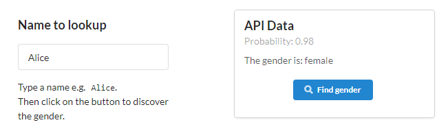

<div align="center">
  <a href="https://crisp-react.winwiz1.com">
    
  </a>
  <br />
  <br />
</div>
<br />
<div align="center">
  
  
  
  
  
</div>

## Project Highlights
* Code splitting. Based on the innovative ability to optionally split your React Application into multiple Single Page Applications (SPA). For example, one SPA can offer an introductory set of screens for the first-time user or handle login. Another SPA could implement the rest of the application, except for Auditing or Reporting that can be catered for by yet another SPA. This approach would be beneficial for medium-to-large React applications that can be split into several domains of functionality, development and testing.

    To achieve better performance it's recommended to split when the size of a production bundle reaches 100 KB. In enterprise environment it's recommended to split regardless of bundle size to protect Intellectual Property (by having a Login SPA and making other bundles available for download to authenticated users only) and augment Role Based Access Security (for example, make the Audit bundle available to users who have either Management or Finance role attested in their JWT token) while parallelizing development among several teams.

* Performance. Achieved by webpack tree shaking, script bundle minification and compression (gzip and Brotli).  Complemented by server-side caching and bundle size containment.

    | Benchmarking Tool | Result | Throttling  |
    | :--- |:---:| :---:|
    | Google Lighthouse |  | not throttled |
    | Google Lighthouse |  | throttled to slow 4G,<br/>CPU slowdown |

    The tool is embedded into Chrome so you can easily benchmark yourself. Follow this [link](docs/benchmarks/PERFORMANCE.md) for the details.

    The backend implements HTTP caching and allows long term storage of script bundles in browser's cache that further enhances performance yet supports smooth deployment of versioning changes in production (eliminating the risk of stale bundles getting stuck in the cache).

* SSR. Build-time SSR (also known as prerendering) is supported. The solution allows to selectively turn the SSR on or off for the chosen part (e.g. a particular SPA) of the React application. This innovative flexibility is important because as noted by the in-depth [article](https://developers.google.com/web/updates/2019/02/rendering-on-the-web) on this subject, SSR is not a good recipe for every project and comes with costs. For example, the costs analysis could lead to a conclusion the Login part of an application is a good fit for SSR whereas the Reporting module is not. Implementing each part as an SPA with selectively enabled/disabled SSR would provide an optimal implementation and resolve this design disjuncture.

    The SSR related costs depend on:

    - Implementation complexity that results in a larger and more knotty codebase to maintain. That in turn leads to more potential problems while implementing the required functionality, writing test cases and resolving support issues.

    - Run-time computing overhead causing [server delays](https://developers.google.com/web/updates/2019/02/rendering-on-the-web#server-vs-static) (for run-time SSR) that defeat or partially offset the performance benefits of SSR.

    - Run-time computing overhead reducing the ability to sustain workloads (for run-time SSR coupled with complex or long HTML markup) which makes it easier to mount DoS attack aimed at webserver CPU exhaustion. In a case of cloud deployment, the frequency of malicious requests could be low enough to avoid triggering DDoS protection offered by the cloud vendor yet sufficient to saturate the server CPU and trigger autoscaling thus increasing the monetary cost. This challenge can be mitigated using a rate limiter which arguably should be an integral part of run-time SSR offerings.

    Choosing build-time SSR allows to exclude the last two costs and effectively mitigate the first one by providing a concise implementation comprised of just few small source [files](https://github.com/winwiz1/crisp-react/tree/master/client/src/utils/ssr). The implementation is triggered as an optional post-build step and is consistent with script bundle compression also performed at the build time to avoid loading the webserver CPU.

    Only the SPA landing page is prerendered. Other SPA pages are not prerendered because these are the internal SPA pages. Switch to the internal pages is performed by SPA without spending time on network trips and hitting the webserver thus lowering its workload and letting it serve more clients simultaneously.

* Overall simplicity. For any starter project or boilerplate, the probability of having bugs/issues down the track increases along with the amount of code. It is shown by the code size badge and can be checked for any GitHub repository using the link: `https://img.shields.io/github/languages/code-size/<user-name>/<repo-name>`. For Crisp React, the React client and the Express backend each contribute ~50% of the codebase.<br/>The code size of other starter projects was a main motivation to develop this solution. The other projects were enjoyable for learning purposes however the amount of code was percieved to be excessive for use in production.

* Full stack and Jamstack builds.
    <table width=100%>
      <tr>
        <th width=15%>Build option</th>
        <th width=35%>What it does</th>
        <th width=50%>Sample builds</th>
      </tr>
      <tr>
        <td>Full stack</td>
        <td>Builds React app and backend.  The latter serves static app files and API responses to end users.<br/> Although in many production deployments the static files would be served to a CDN instead.<br/>Having one server instead of two (one for frontend, another for backend) reduces the attack surface of the deployment, brings down its costs, complexity and delivers other benefits like CORS avoidance.</td>
        <td>Build a container using the supplied Dockerfile and deploy it to any cloud vendor that supports containers including:<ul><li>Google Cloud Run: Single click on the button located below in this section.  Then wait until the build finishes in the cloud and access a website. Fast :clock2: and simple build.</li><li>Heroku: Execute 5 commands from command line and get a website running. Simple build but takes :clock5: a while. Free :coffee: deployment option.</li><li>Google Compute Engine: More complex :scroll: deployment with a series of commands to execute and without any software that needs to be installed.</li></ul></td>
    </tr>
    <tr>
      <td>Jamstack</td>
     <td>Builds the React app only. The build artifacts are served to end users by the webserver supplied by a Jamstack vendor. Since the demo project has no backend, the API calls go directly to the cloud service.<br/> In real life scenarios the API calls could target endpoints implemented by AWS API Gateway or similar infrastructure.</td>
      <td>Build the React app either in the cloud or locally:<ul><li>Cloudflare Pages: Type in 4 simple pieces of data on the configuration screen presented by Pages. Then get a website built and deployed in the cloud. Fast :clock2: and simple build with free :coffee: deployment option.</li><li>AWS S3: More complex :scroll: deployment. Build the website locally and copy build artifacts to a cloud bucket while completing a series of manual deployment steps.</li></ul></td>
      </tr>
    </table>
    Switching between the two options doesn’t require configuration changes though with Jamstack it could be easier (and in the spirit of Jamstack inspired simplicity) to have only one SPA named 'index'. This arrangement ensures the automatically generated HTML file is called `index.html`. It makes integration with some vendors more straightforward.

* CSS Handling. The following four CSS handling approaches can be used:

    <ul>
      <li>Plain CSS: Simple and performant with the burden to track name collisions created by multiple components using rules with similarly named class selectors.
      </li>
      <li>CSS Modules:  Performant with convenience of name collisions resolved automatically and drawback of possible rule repetition leading to an increase in size of the resulting stylesheet. Supports rule reuse via composition.
      </li>
      <li>LESS: Like Plain CSS but with extended CSS syntax and rich additional functionality.
      </li>
      <li>CSS-in-JS: Developer’s convenience with more flexible CSS adjusted if needed during its construction at run-time. The application logic that drives CSS adjustments (for example, driven by the shape of data received) can be sophisticated and challenging to be expressed via CSS created at build time. Overall this approach translates into self-contained and self-adjusting components, development speed and better codebase maintainability (especially when multiple developers or teams are involved). The advantages come at the price of possible rule repetition along with a performance penalty caused by dependency on script bundles download, parsing and execution. There are other, more subtle drawbacks mentioned later.
      </li>
    </ul>

    The solution allows to use each approach as a sole CSS handling technique or combine it with any or all of the remaining three approaches - with no configuration effort. More details are available under the [CSS Handling](#css-handling) heading.

* Containerisation. Used to build and deply full stack builds. A container acts as a mini operating system providing your code with the same run-time dependencies no matter where the container runs. One of the benefits of this approach is that your programs are less likely to break during deployments due to differences between your run-time environment and the one supplied by hosting provider. It makes a container (represented by the sequence of build instructions in `Dockerfile`) to be a robust deployment vehicle.

    Another benefit is vendor lock-in avoidance: Many cloud vendors including AWS, Azure, GCP, Heroku and others accept containers.

    Yet another benefit is the simplicity of deployment. For example, a click on the button shown below will deploy a container on GCP whereas few simple commands provided under the [Using Heroku](#using-heroku) heading will achieve the same for Heroku.

    Docker multi-staged build is used to ensure the backend run-time environment doesn't contain the client build-time dependencies e.g. `client/node_modules/`. It improves security and reduces container's storage footprint.

    - As a single-click container deployment option, you can build and deploy the container on Cloud Run. The prerequisites are to have a Google Cloud account with at least one project created and billing enabled.<br/>
[](https://deploy.cloud.run?git_repo=https://github.com/winwiz1/crisp-react)<br/>
The build will take a while due to free Cloud Shell using a free cloud VM with modest specs. After the build and deployment are finished you can click on the provided link and see the page rendered by the client.<br/><br/>
:heavy_exclamation_mark: It is highly recommended to either add a firewall protection to the created service or to delete it if the deployment was used as a demo/proof of concept. The explanation why this is needed can be found [there](#cloud-run-considerations). Delete the service using the command:<br/>
`gcloud run services delete crisp-react --platform=managed --region=us-central1 --project=<project-name>`<br/>
It can be conveniently executed from the Cloud Shell session opened during the deployment. Update the `region` with the one chosen during the deployment and replace `<project-name>` with your project name. Alternatively delete the service using Cloud Run [Console](https://console.cloud.google.com/run).

* API. In the full stack build the backend communicates with a cloud service on behalf of clients and makes data available via an API endpoint. It's consumed by the clients. The Name Lookup API is used as a sample:
    

    The implementation provides reusable code, both client-side and backend, making it easier to switch to another API. In fact this approach has been taken by the sibling Crisp BigQuery repository created by cloning and renaming this solution - it uses Google BigQuery API instead.<br/>
This arrangement brings a security benefit: The clients running inside a browser in a non-trusted environment do not have credentials to access a cloud service that holds sensitive data. The backend runs in the trusted environment you control and does have the credentials.

* Seamless debugging. Debug a minified/obfuscated, compressed production bundle and put breakpoints in its TypeScript code using both VS Code and Chrome DevTools. Development build debugging: put breakpoints in the client and backend code and debug both simultaneously using a single instance of VS Code.

* Sample websites.
    * [Demo - Full stack](https://crisp-react.winwiz1.com). Automated build performed by Heroku.
    * [Demo - Jamstack](https://crisp-react.pages.dev). Automated build performed by Cloudflare Pages.
    * [Production](https://virusquery.com). Based on Crisp React.

## Table of Contents
- [Getting Started](#getting-started) 
- [Features](#features)
  - [Client and Backend Subprojects](#client-and-backend-subprojects)
  - [SPA Configuration](#spa-configuration)
  - [Testing](#testing)
- [Usage - Jamstack](#usage---jamstack)
  - [Using Cloudflare Pages](#using-cloudflare-pages)
  - [Using AWS S3](#using-aws-s3)
- [Usage - Full Stack](#usage---full-stack)
  - [Using Docker](#using-docker)
  - [Using Heroku](#using-heroku)
  - [Using Google Compute Engine](#using-google-compute-engine)
  - [Cloud Run Considerations](#cloud-run-considerations)
- [Scenarios](#scenarios)
  - [Client Usage Scenarios](#client-usage-scenarios)
  - [Backend Usage Scenarios](#backend-usage-scenarios)
- [SSR](#ssr)
- [CSS Handling](#css-handling)
  - [Plain CSS](#plain-css)
  - [CSS Modules](#css-modules)
  - [LESS](#less)
  - [CSS-in-JS](#css-in-js)
- [Custom Domain and CDN](#custom-domain-and-cdn)
- [What's Next](#whats-next)
- [Pitfall Avoidance](#pitfall-avoidance)
- [Q & A](#q--a)
- [License](#license)

## Getting Started
### Full Stack
Install `yarn` if not already installed: `npm install yarn -g`

<div>
  <details>
    <summary><strong>With VS Code</strong></summary>
    <br />
    Prerequisites: Chrome and VS Code with 'Debugger for Chrome' extension.<br/><br/>
    <ul>
      <li>Clone the <code>crisp-react</code> repository:<br/>
        <br/>
        <code>git clone https://github.com/winwiz1/crisp-react.git</code><br/>
        <code>cd crisp-react</code><br/>
        <br/>
      </li>
      <li>Install dependencies:
        <p>
          <code>yarn install</code>
        </p>
      </li>
      <li>Open the workspace file in VS Code:
        <p>
          <code>code ./crisp-react.code-workspace</code>
        </p>
      </li>
      <li>Start the debugging configuration <code>'Debug Client and Backend (workspace)'</code>.</li>
      <br/>
      <li>Wait until an instance of Chrome starts. You should see the Overview page:
        <p>
          
        </p>
        <br/>
      </li>
      <li>Choose the <code>NameLookup</code> component from the menu. You should see its page:
        <p>
          
        </p>
        <br/>
      </li>
      <li>Stop the running debugging configuration (use the 'Stop' button on VS Code Debugging toolbar two times or press <code>Control+F5</code> twice).</li>
    </ul>
  </details>
</div>
<div>
  <details>
    <summary><strong>Without VS Code</strong></summary>
    <br />
    After executing the following commands:<br/>
	<br/>
    <code>  git clone https://github.com/winwiz1/crisp-react.git</code><br/>
    <code>  cd crisp-react</code><br/>
    <code>  yarn install && yarn start:prod</code><br/>
    <br/>
    you will have a running instance of backend (e.g. Express) serving the newly built React app that can be seen by pointing a browser to <code>localhost:3000</code>.<br/>
    Terminate the backend by pressing <code>Control+C</code>.
  </details>
</div>

The section can be concluded by optionally renaming the solution. Rename the top-level directory from `crisp-react` to `your-project` and set the `SPAs.appTitle` variable in the [`spa.config.js`](https://github.com/winwiz1/crisp-react/blob/master/client/config/spa.config.js) file accordingly. Ignore the rest of the file for a moment, it's covered in depth in the [SPA Configuration](#spa-configuration) section.
### Jamstack
Use the configuration page presented by Cloudflare Pages to let Cloudflare build and deploy the solution. The details are provided under [Using Cloudflare Pages](#using-cloudflare-pages) heading.
## Features
### Client and Backend Subprojects
Each subproject supports execution of the following commands/scripts:
```
yarn compile
yarn lint
yarn test
yarn dev
```
along with additional commands described in [Scenarios](#scenarios).

The client subproject:
 * Starts webpack-dev-server listening on port 8080 in the development mode.
 * Creates build artifacts (html files, script bundles and source maps) in the production mode. The artifacts are meant to be copied over to the backend subproject to be served by Express.
 * Additionally can start an instance of Chrome controlled via Inspector protocol (with caching disabled for better debugging) and point it to either webpack-dev-server or the backend server.
> webpack-dev-server can be referred to as 'devserver'.

The backend subproject:
 * In the production mode starts Express listening on port 3000 to serve from disk the build artifacts created by the client subproject .
 * In the development mode starts Express listening on the same port and working as a proxy for webpack-dev-server.
 * Implements HTTP caching arrangement which disables the caching for .html files and enables it for script bundles. A typical React application comes with .html files that are rather small whereas the bundles can be significantly larger. On the other hand, the build process keeps the names of .html files static and embeds a hash into the names of script bundles. As a result the caching arrangement ensures smooth deployment of versioning changes.
### SPA Configuration
The optional splitting of a React application into multiple SPAs (each rendered by its own bundle) improves the application  loading time. The `vendor` bundle contains `node_modules/` dependencies and is reused between SPAs so that there is no need to download it again when switching from one SPA to another.

Every SPA has a landing page displayed during initial rendering by the component included into the SPA. In webpack terminology such a component is called entry point. An SPA (and its bundle) is comprised of this component, the components it imports and their dependencies. Let's see how Crisp React defines the SPAs.

The client subproject builds an application with SPAs defined by the SPA Configuration block in the [`spa.config.js`](https://github.com/winwiz1/crisp-react/blob/master/client/config/spa.config.js) file:
```js
/****************** Start SPA Configuration ******************/
  var SPAs = [
    new SPA({
      name: "first",
      entryPoint: "./src/entrypoints/first.tsx",
      ssr: true,
      redirect: true
    }),
    new SPA({
      name: "second",
      entryPoint: "./src/entrypoints/second.tsx",
      ssr: false,
      redirect: false
    })
  ];
  SPAs.appTitle = "Crisp React";
/****************** End SPA Configuration ******************/
```
Each SPA is defined using 4 pieces of data: name, entry point (e.g. the landing page component) and two boolean flags. Ignore the flags for a moment. There is also an `appTitle`, it provides the application-wide default setting for the `<title>` tag in the `<head>` section of all pages. The title can be easily overwritten as needed.

SPA's name "first" is used to define the SPA's landing page e.g. `/first.html` and name the bundle that renders the SPA: `first<hash>.js`. More information about all the configuration data pieces is provided in the configuration file comments. The file is copied during the backend build from the client subproject and used to configure the client, the backend and the unit tests.

The demo [website](https://crisp-react.winwiz1.com/) built using the SPA configuration shown above is available.

To reconfigure the application to have a separate SPA for login and another one for the rest of the application, change the SPA Configuration block as follows:
```js
/****************** Start SPA Configuration ******************/
  var SPAs = [
    new SPA({
      name: "login",
      entryPoint: "./src/entrypoints/login.tsx",
      ssr: true,
      redirect: false
    }),
    new SPA({
      name: "app",
      entryPoint: "./src/entrypoints/app.tsx",
      ssr: false,
      redirect: true
    })
  ];
  SPAs.appTitle = "DemoApp";
/****************** End SPA Configuration ******************/
```
and then follow the instructions provided in the configuration file comments.

Since any SPA is comprised of the landing page component (entry point) and its imports, the coding to support the SPA reconfiguration can start by making `login.tsx` render the login page: either directly or maybe with the help of an imported component that will ask for user credentials. Another component could render a page asking for alternative credentials e.g. biometrics or ask for multifactor authentication (MFA).

The entry point `app.tsx` would import the component responsible for rendering the page presented to the user after logging in. Express could potentially be modified to ensure only authenticated users can download the bundle for this SPA.

The newly written `app.tsx` should verify the client is logged in (for example by checking the cookie set by backend after successful login) and if not redirect to the landing page of the 'login' SPA: `/login.html`. In the same manner `login.tsx` should check if the client has been authenticated and if so redirect to `/app.html`. 

No modifications are required for the backend which will be reconfigured to:
* Serve the two HTML pages, namely `/login.html` and `/app.html`, which are the landing pages of our two SPAs.
* Redirect to `/app.html` (due to the boolean `redirect` flag set) other requests in the form `/<path>` or `/<path>.html` provided the `<path>` doesn't include a subdirectory. It's the standard behavior required by all SPAs and implemented in webpack-dev-server using the `historyApiFallback` setting.
* Return 404 error for all other requests except for script bundles and source maps.

To turn off code splitting using multiple SPAs simply leave one SPA in the SPA Configuration block.

> Tip: Let's assume over the time the application has grown and acquired extensive reporting capabilities, perhaps with a reporting dashboard that imports many components. In this case the third SPA and its entry point `reporting.tsx` can be added to the SPA Configuration block. The entry point would import the dashboard and use it for rendering. Such an addition would take little time but bring performance and development/testing benefits. For example, some tests can focus on a React application which has the reporting SPA as the only entry in the SPA Configuration block thus taking the rest of the application out of the testing scope.

### Testing
The solution contains debuggable test cases written in TypeScript. Provides integration with [React Testing Library](https://testing-library.com/docs/react-testing-library/intro) on the client and [Supertest](https://github.com/visionmedia/supertest) on the backend. Both using [Jest](https://jestjs.io/) as an engine.

Both client and backend can be tested independently by executing the `yarn test` command from their respective subdirectories. Alternatively the same command can be executed at the workspace level.

The repository is integrated with [Travis CI](https://travis-ci.com) for Continuous Integration (CI) and with [Cloudflare Pages](https://pages.cloudflare.com) for  Continuous Deployment (CD). Every push to the repository causes Travis and Pages to start a VM, clone the repository and perform a build. Then Travis runs tests while Pages deploys the build to `xxxxx.crisp-react.pages.dev` and also makes it available on [crisp-react.pages.dev](https://crisp-react.pages.dev).

 The test outcome is reflected by the test badge and is also shown by the icon (a check mark :heavy_check_mark: if CI/CD was successful) located after the last commit description and next to the last commit hash. To access more information, click on the icon.

## Usage - Jamstack
As already mentioned, you might prefer to simplify the Jamstack build by having one SPA called "index". This is achieved by having the SPA configuration block:

```js
/****************** Start single SPA Configuration ******************/
  var SPAs = [
    new SPA({
      name: "index",
      entryPoint: "./src/entrypoints/first.tsx",
      ssr: true,
      redirect: true
    }),
  ];
  SPAs.appTitle = "Crisp React";
/****************** End single SPA Configuration ******************/
```
This simplification is optional, Jamstack build supports multiple SPAs.

The following command is used to build a Jamstack client:
```
yarn build:jamstack
```
After the command finishes, the build artifacts are located in the `client/dist/` directory ready to be served by the webserver supplied by a Jamstack provider.

Use the `yarn dev` and `yarn lint` commands executed from the `client/` directory to debug and lint Jamstack client.

### Using Cloudflare Pages
Cloudflare Pages can build the client in the cloud, then create and deploy a website for it. This is done automatically provided the preparatory and configuration steps are completed:

1. Clone Crisp React repository.
    ```
    git clone https://github.com/winwiz1/crisp-react.git
    cd crisp-react
    ```
2. Create a new GitHub repository by visiting [repo.new](https://repo.new).
3. Point the cloned repository to the newly created one and push it there.
    ```
    git remote set-url origin https://github.com/your-github-username/your-newly-created-repo
    git push
    ```
4.  Deploy to Cloudflare Pages by logging into the [Cloudflare dashboard](https://dash.cloudflare.com). Use Menu > Pages > Create a project. You will be asked to authorize read-only access to your GitHub repositories with an option to narrow the access to specific repositories.

    Select the new repository and in the "Set up builds and deployments" section, provide the following information:
    | Configuration option | Value |
    | :--- |:---|
    | Production branch  | `master`  |
    | Build command  | `yarn build:jamstack` |
    | Build output directory  | `/client/dist`  |

    Add the following environment variable:

    | Environment variable | Value |
    | :-------------------- | :----- |
    | NODE_VERSION | `14.17.5` |

    Optionally, you can customize the "Project name" field. It defaults to the GitHub repository name, but it does not need to match. The "Project name" value is used to create a unique per-project `*.pages.dev` subdomain.

    After completing the configuration, click "Save and Deploy" button. You will see the deployment pipeline in progress. When it finishes, the website can be found on the above unique subdomain.

Each subsequent push into the repository will trigger the pipeline. If it finishes successfully, a new website deployment is created and made available on both per-deployment URL and per-project subdomain. You can rollback to any of the earlier deployments anytime. Those are still available to users at the older per-deployment URLs. A rollback ensures that a website available at the created earlier per-deployment URL becomes accessible on the per-project subdomain as well.

Getting the metrics (performance, SEO and others) of the new website is only few clicks away with the cloud instance of Lighthouse ran by Google and available at [this page](https://web.dev/measure/). The metrics should be similar to `crisp-react.pages.dev`:

<div align="center">
  
</div>

> The report generated by web.dev has "CPU/Memory Power" metric at the bottom. It reflects the power of the hardware used by Lighthouse to emulate Moto G4. This metric affects the performance score. Cloud instance of Lighthouse at web.dev runs on a shared cloud VM and the metric reflects the current workload. It varies from time to time.

> The SEO score of your website will be less than 100. You can improve it by changing the domain portion of the [`jamStackDeploymentUrl`](https://github.com/winwiz1/crisp-react/blob/master/client/webpack.config.js#L21) variable's value. Just point it to your per-project subdomain.
### Using AWS S3
Follow the steps described in the [AWS document](https://docs.aws.amazon.com/AmazonS3/latest/userguide/HostingWebsiteOnS3Setup.html).

The "index document name" (mentioned at the steps 2.7 and 5) depends on the name of the SPA that has the `redirect` flag set to `true`. If the simplified SPA configuration block shown at the beginning of this section was used, then the "index document name" is `index.html` otherwise (in case the SPA block was left intact) the name resolves to `first.html`.

Execute the build command shown at the beginning of this section and copy all the files from the `client/dist/` directory (except for maps) to the cloud bucket at the steps 5.6 and 5.7.

## Usage - Full Stack
Assuming the deployment demo in the [Project Highlights](#project-highlights) section has been completed, a container has already been built in the cloud and deployed to Google Cloud Run. In the current section we will build and run the container locally using Docker. This is followed by cloud deployments to Heroku and Google Compute Engine (GCE).
### Using Docker
Install [Docker](https://docs.docker.com/get-docker/). To perform full stack build of Crisp React as a Docker image and start a container, execute Windows command file [`start-container.cmd`](https://github.com/winwiz1/crisp-react/blob/master/start-container.cmd) or Linux shell script [`start-container.sh`](https://github.com/winwiz1/crisp-react/blob/master/start-container.sh). Then point a browser to `localhost:3000`.

> Both the command file and the shell script can also be executed from an empty directory in which case uncomment the two lines at the top of each file. Moreover, the files can be copied to a computer or VM that doesn't have NodeJS installed. The only prerequisites are Docker and Git.

> Pre-built Docker image is available at [Docker Hub](https://hub.docker.com/repository/docker/winwiz1/crisp-react).
### Using Heroku
Install [Heroku CLI](https://devcenter.heroku.com/articles/heroku-cli#download-and-install).  Then execute `heroku login` command.

Clone the repository:
```
git clone https://github.com/winwiz1/crisp-react.git
cd crisp-react
```
Finally perform full stack build of Crisp React as a Docker image and deploy it to Heroku:
```
heroku container:login
heroku create <app-name>
heroku stack:set container -a <app-name>
heroku container:push web -a <app-name>
heroku container:release web -a <app-name>
```
Replace the  `<app-name>` placeholder with your Heroku app name.  The app will have the URL: `<app-name>.herokuapp.com`.

If you own a domain name, then it's recommended to add a CDN by implementing the optional steps described in the [Custom Domain and CDN](#custom-domain-and-cdn) section. It will significantly boost performance and improve security to some extent. The extent is limited due to the fact that the DNS record for your app e.g.`xxxxxx.herokudns.com` is public so the CDN can be bypassed with a potential attacker accessing your app directly.
### Using Google Compute Engine
In this section we are going to create a VM instance with OS optimised by Google (performance and security wise) to run a container. More specifically, the instance will run a container built using Crisp React code taken from GitHub repository and optionally modified by you before the build.

> This section can be completed without installing any software.

#### Costs
Currently a single `e2-micro` VM instance is conditionally free. That is, there is no charge for one such VM per billing account provided it has been deployed in one of the few selected regions including `us-west1`. We will deploy in this region.

The cost of a static IP address and charges for egress (network traffic from our VM to Internet) are specified [there](https://cloud.google.com/vpc/pricing). The static IP address cost is around $3 USD per month and will initially be charged against 90 days, $300 [free credit](https://cloud.google.com/free/docs/gcp-free-tier/#free-trial) offered to new customers. The egress charges are perceptible if there are Gigabytes of traffic which is unlikely   for our trial deployment with Cloudflare CDN - it offers unlimited cache bandwidth and free DDoS protection on all plans including the Free Plan.

As an extra precautionary measure against an unexpected bill, you can create a throw-away project at the first Deployment step described below and dispose of the project at the end of this section.
#### Deployment
* To get started with GCE complete the _Before you begin_ [section](https://cloud.google.com/compute/docs/quickstart-linux#before-you-begin). Accept the suggestion to create a throw-away project at the step 1 and ensure this project is selected as the default.
* If you prefer to work with your local development environment then install Cloud SDK by following instructions on this [page](https://cloud.google.com/sdk/install). Alternatively start [Cloud Shell](https://cloud.google.com/shell/docs/launching-cloud-shell) which is a free VM with Cloud SDK and other software preinstalled.
* Enable Artifact Registry and Cloud Build for your project by executing the commands:
    ```
    gcloud services enable artifactregistry.googleapis.com
    gcloud services enable cloudbuild.googleapis.com
    ```
* Ask Artifact Registry to create a Docker repository called `crisp-react-repo`:
    ```
    gcloud artifacts repositories create crisp-react-repo --repository-format=docker --location=us-west1 --description="My test Docker repository"
    ```
* Give `docker` access to this repository and all other repositories (if any) in the `us-west1` region:
    ```
    gcloud auth configure-docker us-west1-docker.pkg.dev
    ```
 * Clone Crisp React repository:
    ```
    git clone https://github.com/winwiz1/crisp-react.git
    cd crisp-react
    ```
    > The subsequent commands have to be executed from `crisp-react/` directory.

    Optionally make some code changes.
    > Since containers facilitate full stack builds, consider various building and debugging scenarios provided under the [Scenarios](#scenarious) heading. As a very minimum, consider `yarn start:prod` followed by pointing a browser to http://localhost:3000 to check the React app is working.

* Decide if you prefer to build a Docker image locally or in the cloud. For the local option, the following commands will build the image and push it to  `crisp-react-repo` repository:
    ```
    docker build -t us-west1-docker.pkg.dev/your-throw-away-project-name/crisp-react-repo/crisp-react-image:1.0 .
    docker push us-west1-docker.pkg.dev/your-throw-away-project-name/crisp-react-repo/crisp-react-image:1.0
    ```
    Alternatively achieve the same in the cloud (Docker doesn't need to be installed):
    ```
    gcloud builds submit --tag=us-west1-docker.pkg.dev/your-throw-away-project-name/crisp-react-repo/crisp-react-image:1.0 .
    ```
* Create a static IP address `crisp-react-ip`:
    ```
    gcloud compute addresses create crisp-react-ip --network-tier STANDARD --region us-west1
    ```
    > Note there is a charge (it was mentioned above) for the address that is higher if the address is not assigned to a VM.

* Create a [Container-Optimized OS](https://cloud.google.com/container-optimized-os/docs) VM instance `crisp-react-vm` to run a container created from our Docker image held in `crisp-react-repo` repository:
    ```
    gcloud compute instances create-with-container crisp-react-vm \
    --project your-throw-away-project-name \
    --container-image us-west1-docker.pkg.dev/your-throw-away-project-name/crisp-react-repo/crisp-react-image:1.0 \
    --container-stdin \
	 --container-tty \
	 --machine-type=e2-micro \
	 --zone=us-west1-b \
	 --scopes=cloud-platform \
	 --tags=crisp-react-tag \
	 --network-interface=network-tier=STANDARD,address=crisp-react-ip \
	 --metadata=cos-update-strategy=update_disabled,google-logging-enabled=false \
	 --metadata-from-file=startup-script=./deployments/gcp/startup.sh
    ```   
* Create a firewall rule to allow incoming HTTP traffic:
    ```
    gcloud compute firewall-rules create crisp-react-rule \
	--description="Allow incoming HTTP traffic" \
	--direction=INGRESS \
	--allow tcp:80 \
    --target-tags=crisp-react-tag \
	--priority=1000 \
	--enable-logging
	```
* Find out the external IP address (referred to below as `external-address`):
    ```
    gcloud compute addresses describe crisp-react-ip --region us-west1
    ```
    Use a browser to check if the React app is working: `http://external-address`. You should see a page similar to [this](https://crisp-react.winwiz1.com).
#### Cloudflare CDN
If you own a domain name, then it’s highly recommended to add a CDN. It will significantly boost both performance and security. The steps are:

* Login to Cloudflare dashboard and [add a site](https://support.cloudflare.com/hc/en-us/articles/201720164-Creating-a-Cloudflare-account-and-adding-a-website). In response, Cloudflare will provide you with the names of two DNS nameservers.

* Login to the domain registrar account and change the nameservers from the ones supplied by the registrar to the nameservers provided at the previous step.

* In Cloudflare dashboard add a DNS record:
    | Type | Name | IPv4 address |
    | :---:| :---:|:---|
    | `A` | `your-domain` | `external-address` |
    
    Ensure "Proxy status" of this record is set to "Proxied".

* Perform the Step 6 located under the [Custom Domain and CDN](#custom-domain-and-cdn) heading to exempt API calls and responses from caching.

#### Final Steps
* Verify that integration with Cloudflare was successful by checking the page `https:/your-domain/cdn-cgi/trace`. It should resemble the content of  `https:/crisp-react.winwiz1.com/cdn-cgi/trace`.

* Whitelist the IP addresses used by Cloudflare to ensure that CDN cannot be bypassed and no one can access the `external-address` directly. To effect this restriction add the `--source-ranges=<csv-list>`    command-line option to the `gcloud compute firewall-rules create` command shown before. The `<csv-list>` placeholder needs to be replaced by the comma-separated list of [IP ranges](https://www.cloudflare.com/ips) used by Cloudflare.

* The `crisp-react-vm` impersonates the default GCE service account and uses the default VPC. Consider replacing both resources with their non-default counterparts to improve security.

* The  `crisp-react-vm` has its logging disabled to save memory and reduce workload on CPU. Consider upgrading the VM from `e2-micro` to a more potent type in order to enable COS updates and logging.

* Despite of having the CDN and GCE firewalls effectively chained,  it's still imperative to have a reverse proxy (in front of Express server) that has been specifically hardened to be exposed to Internet directly or via a firewall. Nginx is written in C and would be a good candidate being available as a Docker image. A container created from this image should sanitise all the API requests before it hit Express and clamp down on HTTP verbs, request size, limit ingress rate (in addition to rate limiting already implemented in Express) etc.

    > As for Express, its code is executed by V8 engine. It compiles JS into CPU instructions at run-time further optimising the compiled code, again at run-time. The compilation is more or less predictable but the optimisation is not because in order to achieve the best performance it depends on run-time inputs. This lack of predictability (e.g. non-deterministic code optimisation) makes a comprehensive security audit of V8 impossible and results in zero day vulnerabilities.

* Delete the throw-away project created earlier. This will clean up the VM and other resources created throughout this section.

### Cloud Run Considerations
The remainder of this section contains additional considerations that apply to deploying the solution on Cloud Run. The considerations are not specific to this solution and would be relevant for any React SPA.

Although Cloud Run provides an ample free tier usage in terms of bandwidth and number of requests, you are billed for the incoming requests once the free usage threshold, 2 million calls per month, is exceeded. This scenario wouldn’t be infeasible if the service URL is discovered and used to mount a Layer 7 DDoS attack (or come close to it by emulating a significant workload). There is an additional cost for the running time exceeding its free threshold which can be exacerbated by the service scaling itself up under attack.

Therefore adding a firewall with IP address black/whitelisting and rate limiting or deleting the service promptly after a demonstration helps to mitigate this risk. Alternatively a Cloud Run service can be deployed in non-public access [mode](https://cloud.google.com/run/docs/securing/ingress) (`--ingress internal`), however this is outside of our scope aimed at a public website creation.

It would appear that using ingress control or rate limiting was [not possible](https://stackoverflow.com/questions/59014001/ip-filtering-on-google-cloud-run) in the past with Cloud Run  in public access mode. This functionality is currently available however it's not added directly to Cloud Run.  Rather it requires a serverless network endpoint group ([NEG](https://cloud.google.com/load-balancing/docs/negs/serverless-neg-concepts)). Once a NEG has been created, you can use other GCP products e.g. external HTTPS [load balancer](https://cloud.google.com/load-balancing/docs/https/traffic-management) to implement rate limiting or [Cloud Armor](https://cloud.google.com/armor/docs/integrating-cloud-armor#serverless) to control ingress. You might want to check if the price of either product fits into your budget.

## Scenarios
The Usage Scenarios below are grouped depending on whether  the client or the backend subproject is used. The Client Usage Scenarios apply to both Jamstack and full stack builds. The Backend Usage Scenarios apply to the full stack buld only.
>:bulb: This section can be skipped at first reading. You can proceed to the [next](#ssr) section.

In case there are any changes made to the SPA Configuration block and the changes are recent (e.g. no client and backend builds have been performed since then), execute the `yarn build` command at the workspace level before starting the debugging configurations described below in the Client and Server Usage sections.
> Tip: The commands executed in VS Code Terminal can also be executed from a command or shell prompt in the relevant directory and vice versa.

### Client Usage Scenarios
To start with client scenarios open the `client` subdirectory in VS Code. Then open the Terminal. 
#### Run devserver and use Live Reloading
Execute in Terminal: `yarn dev`. Wait until the command finishes.<br/>
Start a browser and point it to `localhost:8080`. You should see the First SPA overview page.<br/>
VS Code: Open `src/components/Overview.tsx` and alter the text on the page. As you type, note the compilation progress in the Terminal followed by automatic browser refresh. The newly typed content should be shown on the overview page. If instead of starting a browser you used already running instance, then you might need to refresh the browser to get Live Reloading working.<br/>
To finish, press `Control+C` in the Terminal.<br/>
When to use: Develop the part of UI that doesn't need backend data. 
#### Debug client using devserver and VS Code
VS Code: Start the `Launch Chrome Connected to Devserver` debugging configuration.<br/> 
Wait until an instance of Chrome starts and shows the overview page.<br/>
VS Code: Put a breakpoint on the following line: `src/components/ComponentB.tsx:14`.<br/>
Use the overview page menu to choose the ComponentB. The breakpoint in VS Code will be hit. Press F5 to continue execution. Alternatively use Chrome to continue execution. Note Live Reloading is supported.<br/>
To finish, remove the breakpoint and stop the running debugging configuration (use Debugging toolbar or press `Shift+F5`).<br/>
When to use: Troubleshoot the client provided backend data is not required.
#### Debug client using devserver and Chrome DevTools
Follow the "Debug client using devserver and VS Code" scenario  to see the overview page.<br/>
In the instance of Chrome started, open Chrome DevTools.<br/>
Use 'Sources -> Filesystem -> Add folder to workspace' to add `client/src` directory. In this directory open the file `src/components/ComponentB.tsx` and put a breakpoint on the line 14.<br/>
Use the overview page menu to choose the ComponentB. The breakpoint in Chrome DevTools will be hit. Go to VS Code and note it knows the execution has stopped on this line of code and lets you inspect variables. Use Chrome or VS Code to continue execution. Note Live Reloading is supported.<br/>
To finish, remove the breakpoint and stop the running debugging configuration (use Debugging toolbar or press `Shift+F5`).<br/>
When to use: Troubleshoot UI, inspect DOM tree, etc. provided backend data is not required.
#### Build client for development or production
To perform the development build execute in Terminal: `yarn build`. The build artifacts can be found under `client/dist` directory.<br/>
>:bulb: You might want to edit `client/webpack.config.js` file and change the [three](https://github.com/winwiz1/crisp-react/blob/master/client/webpack.config.js#L15-L19) `metaXxx` variables to alter the `<meta>` tags describing your website to the search engines.

To perform the production build execute in Terminal: `yarn build:prod`. The build artifacts including the bundles with various compressions can be found under the same directory. If a bundle is too small to benefit from compression then it won't be compressed.<br/>
When to use: As a preparatory step when the backend is required. This step will be executed automatically by the backend usage scenarios below when needed.
#### Test client
Terminal: `yarn test`
#### Debug client test cases
VS Code: Put a breakpoint in any `.test.tsx` file.<br/>
VS Code: Start 'Debug Jest Tests' debugging configuration. Wait until the breakpoint is hit.<br/>
To finish, remove the breakpoint and stop the running debugging configuration (use Debugging toolbar or press `Shift+F5`).
#### Lint client
Terminal: `yarn lint`
### Backend Usage Scenarios
#### Build backend in production mode
Open a command prompt in the directory containing the workspace file `crisp-react.code-workspace` .<br/>
Execute command: `yarn build:prod`.<br/>
When to use: Prior to backend deployment, for example before copying the backend to the filesystem of a Docker container.
#### Run backend in production mode
Open a command prompt in the directory containing the workspace file `crisp-react.code-workspace` .<br/>
Execute command: `yarn start:prod`. It will build both the client application and the backend.<br/>
To run without build execute: `yarn run:prod`.<br/>
To stop the backend terminate the running command e.g. press `Control+C`.
#### Run backend with Live Reloading
Open the workspace file  `crisp-react.code-workspace`  in VS Code.<br/>
Start the debugging configuration  `Debug Client and Backend (workspace)`.<br/>
Wait until an instance of Chrome starts. You should see the overview page.<br/>
VS Code: Open `client/src/components/Overview.tsx` and alter the text on the page. After a few seconds delay the new content should be shown in the browser.<br/>
To finish, stop the running debugging configuration (use the ‘Stop’ button on VS Code Debugging toolbar two times or press  <code>Control+F5</code>  twice).
#### Test backend
Open a command prompt in the `server` subdirectory.<br/>
Execute command: `yarn test`
#### Debug backend test cases
Open the `server` subdirectory in VS Code.<br />
Put a breakpoint in `.test.tsx` file.<br/>
Start 'Debug Jest Tests' debugging configuration. Wait until the breakpoint is hit.<br/>
To finish, remove the breakpoint and stop the running debugging configuration.
#### Lint backend
Open a command prompt in the `server` subdirectory.<br/>
Execute command: `yarn lint`
#### Debug backend and client simultaneously
Open the workspace file  `crisp-react.code-workspace`  in VS Code.<br/>
Start the debugging configuration  `Debug Client and Backend (workspace)`.<br/>
Wait until an instance of Chrome starts. You should see the overview page.<br/>

<div>
  <details>
    <summary>Using VS Code example:</summary>
    <br/>
Note that VS Code can mark a breakpoint with a circle that is grey and hollow rather than red and solid, referring to it as 'Unverified breakpoint'. You can check the breakpoint has been set and marked with solid red circle by highlighting the relevant process (client or server) on VS Code Debug sidebar in the CALL STACK view.<br/>
    <br/>
Put a breakpoint on the following line:  <code>server/src/Server.ts:59</code>.<br/>
In the browser choose the ComponentC from the menu, the breakpoint will be hit. Remove the breakpoint and resume the execution.<br/>
Put a breakpoint on the line <code>client/src/components/ComponentB.tsx:14</code>.<br/>
Use the menu to go back to the First SPA and then choose the ComponentB. The breakpoint will be hit. Remove the breakpoint and resume the execution. Choose the ComponentA from the menu.<br/>
  </details>
</div>
<div>
    <details>
      <summary>Using Chrome DevTools example:</summary>
      <br />
      In the instance of Chrome started, open Chrome DevTools.<br/>
Use 'Sources -> Filesystem -> Add folder to workspace' to add <code>client/src</code> directory. In this directory open the file <code>src/components/ComponentB.tsx</code> and put a breakpoint on line 14.<br/>
Use the overview page menu to choose the ComponentB. The breakpoint in Chrome DevTools will be hit. Remove the breakpoint and use Chrome or VS Code to continue execution.
</details>
</div>

To finish, stop the running debugging configuration (use the ‘Stop’ button on VS Code Debugging toolbar two times or press  <code>Control+F5</code>  twice).
#### Use backend to debug the production client build
Open the workspace file  `crisp-react.code-workspace`  in VS Code.<br/>
Edit file `client/webpack.config.js` to change the `sourceMap` setting of the TerserPlugin config to `true`.<br/>
Start the debugging configuration  `Debug Production Client and Backend (workspace)`.<br/>
Wait until an instance of Chrome starts. You should see the overview page. Now you can use VS Code to set breakpoints in both client and backend provided the relevant process is highlighted/selected as explained in the previous scenario. You can also use Chrome DevTools to debug the client application as shown above.<br/>
To finish, stop the running debugging configuration (use the Debugging toolbar or press  `Control+F5`  once).
## SSR
### Turning On and Off on the Application Level
SSR is enabled for production builds. In order to turn it off rename the `postbuild:prod` script in [`package.json`](https://github.com/winwiz1/crisp-react/blob/master/client/package.json), for example prepend an underscore to the script name. This will reduce the build time.
### Turning On and Off on the SPA Level
By default SSR is enabled for the [`first`](https://github.com/winwiz1/crisp-react/blob/master/client/src/entrypoints/first.tsx) SPA and disabled for the [`second`](https://github.com/winwiz1/crisp-react/blob/master/client/src/entrypoints/second.tsx) SPA. To toggle this setting follow the instructions provided in the respective file comments.
## CSS Handling
### Plain CSS
To take this approach create a file with the `.css` extension and a name that doesn’t end with `.module.css`. Place it anywhere under the [`src/`](https://github.com/winwiz1/crisp-react/blob/master/client/src) subdirectory, for instance under `src/css/` or next to your component under `src/components/`.

Multiple files can be created. At the build time all [imported](https://github.com/winwiz1/crisp-react/blob/master/client/src/entrypoints/first.tsx#L26) `.css` files will be combined into a single stylesheet with class selectors left intact. The stylesheet, created under `client/dist/`, will be downloaded and cached by a browser.

The solution uses this approach for two purposes:
- To put frequently used CSS rules on the global scope and share it among components to avoid duplication caused by each component having its own similar rule.
    Suppose you are creating an accessible webapp so each component has lots of `<span>` elements with various screen reader prompts and the same class name: `class=’sr-only’`. The relevant CSS rule in a plain CSS file like [this](https://github.com/winwiz1/crisp-react/blob/master/client/src/css/app.css) one can be easily shared.

- To modify styling of an existing or third party library component that expects predefined class selectors. For example, like in [that](https://github.com/winwiz1/crisp-react/blob/master/client/src/css/react-day-picker.css) file.
### CSS Modules
The filename of a module must end with `.module.css`. At the build time all such files will be combined into the single stylesheet mentioned above with class selectors mangled to ensure uniqueness.

To embed class selectors into JSX code the mangled names are required. These names are not available until a build is completed. Therefore [this](https://github.com/winwiz1/crisp-react/blob/master/client/src/components/BaseComponent.tsx#L16-L20) helper object is used to map unmangled class selectors (e.g. `.left_component`) into the mangled ones (returned by `cssStyle.left`).

In order to improve loading performance, the solution [uses](https://github.com/winwiz1/crisp-react/blob/master/client/src/css/base-component.module.css) this approach for the CSS that determines the overall layout of a page (or a major component) while leaving more subtle/detailed and numerous CSS rules for the CSS-in-JS library.

> Letting CSS-in-JS handle a rule that determines page's layout could introduce unwanted CLS (Cumulative Layout Shift). The CLS will likely be delayed due to the typical CSS-in-JS delay and visible to users as a sudden and unpleasant jerk movement.

### LESS
LESS is like plain CSS but on steroids. Lots of extra [features](https://lesscss.org/features/) are available. The solution [uses](https://github.com/winwiz1/crisp-react/blob/master/client/src/css/app.less) one such feature: 'parent selector' denoted by ampersand.

Multiple `.less` files can be created. At the build time all [imported](https://github.com/winwiz1/crisp-react/blob/master/client/src/entrypoints/first.tsx#L27) `.less` files will be combined into the single stylesheet along with the rules produced by plain CSS files and CSS modules.

### CSS-in-JS
The `@emotion/react` package of the Emotion library is used. To take this approach follow the [documentation](https://emotion.sh/docs/css-prop#object-styles) and search for the  `css({` pattern in `.tsx` files located under `src/components/`.

The class selectors are generated at run-time in browser's memory and combined into a separate stylesheet. The stylesheet is then programmatically inserted into the `<head>` element of the DOM tree.

The insertion is delayed by script bundles processing and execution. Other drawbacks of this approach include possible CLS and loss of JSX code portability. Also the Emotion library is not Atomic (see the [review](https://github.com/andreipfeiffer/css-in-js#11-atomic-css)) so rule duplication is an issue.

## Custom Domain and CDN
This section complements the deployment described under the [Using Heroku](#using-heroku) heading. It maps Heroku app URL to a custom domain you own. After that, Cloudflare CDN is added in front of Heroku servers<br/>


to take advantage of the distributed cache provided by Cloudflare and achieve much better performance with improved security. Both custom domain and CDN are optional. If you haven't used Cloudflare previously this [answer](https://www.quora.com/Cloudflare-product/How-does-Cloudflare-work-Does-Cloudflare-just-divert-malicious-traffic) could be useful.

Prerequisites:
- Custom domain name ownership,
- Cloudflare account. It's free and can be created by following this [link](https://dash.cloudflare.com/sign-up).

The steps:

1. Log to the registrar of your custom domain e.g. `yourdomain.com` and create a subdomain, for example `crisp-react.yourdomain.com`. While you can choose any valid name for the subdomain, 'crisp-react' will be assumed for the next steps.

2. Click on the "Add domain" button on Heroku Settings page at `https://dashboard.heroku.com/apps/<app-name>/settings` to add `crisp-react.yourdomain.com` as a custom domain to your app. Heroku will provide a name of a host similar to `xxxxx.herokudns.com`. Copy this name to the clipboard.

3. Use the DNS settings provided by the registrar to add a DNS record:
    | Record Type | Host or Name | Value or Points To or Content |
    | :---:| :---:|:---|
    | `CNAME` | `crisp-react` | `xxxxx.herokudns.com` |

    It will take some time for the new record to propagate across the globe. Once this delay is over, the Heroku app will be available from `crisp-react.yourdomain.com`.

4. Log to Cloudflare [dashboard](https://dash.cloudflare.com/) and add the root domain `yourdomain.com` as a site to your account. Choose either the Free or a paid Cloudflare [plan](https://www.cloudflare.com/plans). As for SSL settings, select the Full option if the Heroku app is accessible via HTTPS protocol and the Flexible option if it uses HTTP.

    At the end Cloudflare will provide you with the hostnames of the two of its name servers.  Use the DNS settings provided by the registrar (some registrars keep name servers under different menu/setting) to replace the name servers of your registrar with the ones provided by Cloudflare.

5. Adjust Cloudflare DNS setting for the newly added site. During the step (4) Cloudflare likely have discovered most of the DNS records applicable to the domain `yourdomain.com` from the registrar and automatically imported those. However the `CNAME` record added at the step (3) could be missing in which case you will need to add it again, this time to Cloudflare DNS settings.

    In case there is no site or app mapped to `yourdomain.com` or in case there is one but you are not interested in it being processed by Cloudflare, change 'Proxy Status' of Cloudflare DNS entries from 'Proxied' to 'DNS only'  leaving only the `CNAME` record created at the step (3) or (5) in the 'Proxied' state:<br/>
    

    The setting can be toggled by clicking on the orange Cloudflare icon.

6. Use Cloudflare Page Rules to add the following two rules:
    - The first rule:<br/>
        

    - The second rule:<br/>
        

    The order of the rules is important. Since only one page rule is applied, the more specific API rule should be on the top.

    The maximum cache duration was limited to 2 hours on the Free plan, however Cloudflare has removed this restriction. For example, you can set the duration to 7 days and ensure the subsequent re-caching occurs every week for all .html pages, script bundles etc.

After the steps are completed the Heroku app will be using distributed caching and a free SSL certificate for the custom domain. Also the cache related statistics, monitoring and the breakdown of incoming requests by country will be available from Cloudflare even on the Free plan.

You can test DNS resolution for `crisp-react.yourdomain.com` using tools like `nslookup` or `dig` to check it resolves to IP addresses that belong to Cloudflare, similarly to the demo [site](https://crisp-react.winwiz1.com/).

## What's Next
Consider the following steps to add the desired functionality:
### Full stack build
* Start with [Client Usage Scenarios](#client-usage-scenarios) to develop UI in absence of API data. For example, develop the initial look and feel of the login page. Take advantage of the Live Reloading to speed up the development. The client scenarios ensure the backend is not started needlessly.
*  Implement an API endpoint in the backend, in addition or instead of the existing sample API endpoint. For example, a login endpoint. Technically it can be done by renaming the `SampleXxx` pattern in the names of source files and classes with `LoginXxx`, then modifying the classes as needed. This approach can be observed in the sibling [Crisp BigQuery](https://github.com/winwiz1/crisp-bigquery) repository, the `SampleXxx` pattern was replaced with `BigQueryXxx`.
*  Switch to [Backend Usage Scenarios](#backend-usage-scenarios) to consume the API endpoint in the client.  Modify the API related classes `BackendManager` and `BackendRequest` as needed. Keep taking advantage of Live Reloading that is supported for client and backend code.
### Jamstack build
* Start with Client Usage Scenarios as described above for Full stack build.
* Implement a 3rd party API endpoint(s) and consume it.
## Pitfall Avoidance
One of the goals pursued by the [Backend Usage Scenarios](#backend-usage-scenarios) is to avoid the following common pitfalls:
- :fire: Running the webpack-dev-server in production.
- :warning: Getting CORS security violations triggered by the browser which detects that script bundles were downloaded from one server (frontend) and then the code from the bundles attempts to call API endpoints provided by another server (backend). There are CORS related HTTP headers that exist to water down or cancel completely the security which browsers implement for a reason. In some cases using such headers is unavoidable, for example the code from some Google SDKs is embedded into clients at the build time and not downloaded from Google at run-time, so many Google APIs wouldn't work without CORS headers. But its usage is best to be kept to the minimum because it raises the requirements for backend hardening.
- :thumbsdown: Not implementing SPA related fallback in the backend. It should redirect requests for unknown pages to the SPA landing page. For example, this behaviour is enabled in webpack-dev-server using the `historyApiFallback` setting which exists specifically to support SPAs. The fallback behavior is required for any SPA because a user can see the path to an internal page (e.g. `/a` or `/b` or  `/namelookup`) in the navigation bar and can either retype it manually and press Enter or refresh the browser. In both cases the backend gets hit with a request for an internal SPA page it is not aware of and responding with the 404 Not Found error doesn't look good for the user. Due to security considerations the fallback tolerance should have its limits and clearly invalid requests should still trigger an error.

 The backend scenarios ensure the client gets everything (build artifacts including script bundles, API responses) from the backend only. This leaves no room for CORS issues. The SPA related fallback is implemented in development and production automatically and in accordance with SPA configuration.

The webpack-dev-server is never started in production. This is hardly a good idea. The server, as its name suggests, is meant to be used in development only.
## Q & A
Q: I have changed both SPA names in the SPA Configuration block and kept the rest including the entry points intact. I expect everything to keep working using my new names for the SPA landing pages instead of the old `/first.html` and `/second.html`.  However navigation via the menu and Back/Forward browser buttons seems to be broken. How can it be fixed.<br/>
A: Clear the browser's history and cache. Alternatively use an incognito tab. The client, the backend and the tests should work with the new names.

Q: Which versions of Internet Explorer are supported.<br/>
A: This project aims to work with browsers that are supported by vendors and can be made secure via security updates. Therefore IE11 is supported whereas IE10 and the earlier versions are not. The unsupported versions render a blank page with explanatory [message](https://github.com/winwiz1/crisp-react/blob/master/client/src/entrypoints/head-snippet.html#L8-L10) asking to upgrade.

Q: Can I use dynamic imports in addition to multiple SPAs for code splitting?<br/>
A: Yes, dynamic imports are fully supported. For example, if there is a Reporting bundle and one component is known to be used infrequently, then it's a good candidate to be separated from the bundle using a dynamic import:
```js
const ReportingWrapperXXX = React.lazy(() => import(
  /* webpackChunkName: "reporting-xxx" */
  /* webpackMode: "lazy" */
  /* webpackPrefetch: "false" */
  '<path>/InfrequentReporting'
));
...
// Can have its own Redux store to coexist with the main Redux store
export const ReportingPanelXXX: React.FC = _props => {
  return (
    <Provider store={reportingStoreXXX}>
      <React.Suspense fallback={<div>Loading...</div>}>
        <ReportingWrapperXXX />
      </React.Suspense>
    </Provider>
  );
}
```
Remember to change the settings in `tsconfig.json`:
```
"removeComments": false,
"module": "esnext",
```
 otherwise the dynamic import will be ignored and webpack 'magic comments' removed.
 
 > Note: `React.lazy` has a restriction, it works with default exports only. The restriction should be lifted in the future. When webpack detects dynamic imports, it emits code that loads the bundle it created asynchronously and `Suspense/lazy` needs to wait for the loading to complete. This technology is less straightforward and probably less mature than building a static bundle and referencing it via the `<script>` tag  in .html file.

In case you have a utility class used infrequently, it can also be imported dynamically. This can be done using `await import` and without `Suspense/lazy`. The sibling [Crisp BigQuery](https://github.com/winwiz1/crisp-bigquery) repository (derived from Crisp React)  [provides](https://github.com/winwiz1/crisp-bigquery/search?q=%22await+import%22) a working example.

Q: Do dynamic imports negate the need to have multiple SPAs.<br/>
A: It depends. These two are complementary techniques. Obviously once a bundle grows larger, it starts affecting performance as its loading time increases. But the reverse is also true, having too many small bundles could result in more network round-trips and the bundle compression will become less efficient. It can also complicate attempts to scrutinise network traffic including requests for bundles.

Q: How can I add my own HTML including polyfills etc. to the generated .html files?<br/>
A: Use react-helmet to add additional HTML tags to the `<head>` element and modify the existing ones. Alternatively use the `client\src\entrypoints\head-snippet.html` file. Its content is inserted into the `<head>` element. You can add a [bodyHtmlSnippet](https://github.com/jaketrent/html-webpack-template) by changing the `HtmlWebpackPlugin` configuration in `webpack.config.js` (search for `headHtmlSnippet` and add similar code).

Q: How can I fix TypeScript compilation errors?<br/>
A: Note the TypeScript version in `package.json`. Ensure the TypeScript version shown at the VS Code status bar when .ts or .tsx file is opened is not lower.

Q: Breakpoints in Chrome DevTools are not hit. How can I fix it?<br/>
A: Open the Settings page of the Chrome DevTools and ensure 'Enable JavaScript source maps' and 'Disable cache (while DevTools is open)' boxes are ticked. Close the Settings page and on the Network tab tick the 'Disable cache' box. If debugging a production build, change the `sourceMap` setting of the TerserPlugin config to `true` in `webpack.config.js`, then restart debugging.

Q: Breakpoints in VS Code are not hit. How can it be fixed.<br/>
A: Try to remove the breakpoint and set it again. If the breakpoint is in the client code, refresh the page.

Q: I'm debugging the backend in VS Code by running one of the debugging configurations specified in [launch.json](https://github.com/winwiz1/crisp-react/blob/master/server/.vscode/launch.json). How can I get one of the yarn scripts (e.g. `copyfiles` or `prestart` in the `scripts` section of [package.json](https://github.com/winwiz1/crisp-react/blob/master/server/package.json)) executed before the debugging starts?

> This question is inspired by the issue #11

A: What gets executed before a debugging configuration starts is controlled by its optional `preLaunchTask` setting. This setting refers to a task from [tasks.json](https://github.com/winwiz1/crisp-react/blob/master/server/.vscode/tasks.json) by the task name. The name is defined by the tasks'`label` setting. To get a yarn script executed, add another task (let's call it `prestart`) to run the `prestart` script and chain both tasks using `dependsOn`:

<div>
  <details>
    <summary>tasks.json</summary>
    <br />
    <pre>
{
  "version": "2.0.0",
  "tasks": [
    {
      "label": "tsc",
      "type": "typescript",
      "tsconfig": "tsconfig.json",
      "problemMatcher": [
        "$tsc"
      ],
      "group": {
        "kind": "build",
        "isDefault": true
      }
    },
    {
      "label": "tsc-watch",
      "type": "typescript",
      "tsconfig": "tsconfig.json",
      "option": "watch",
      "problemMatcher": [
        "$tsc-watch"
      ],
      "isBackground": true,
      "presentation": {
        "echo": true,
        "reveal": "always",
        "focus": false,
        "panel": "new"
      },
      "dependsOn": [
        "prestart",
      ]
    },
    {
      "label": "kill process in terminal",
      "type": "process",
      "command": "${command:workbench.action.terminal.kill}"
    },
    {
      "label": "prestart",
      "type": "npm",
      "script": "prestart",
      "presentation": {
        "reveal": "never"
      }
    }
  ]
}
    </pre>
  </details>
</div>

Q: I need to add Redux.<br/>
A: Have a look at the sibling Crisp BigQuery repository created by cloning and renaming this solution. It uses Redux.
## License
Crisp React project with its 'server' and 'client' subprojects is open source software [licensed as MIT](./LICENSE).

