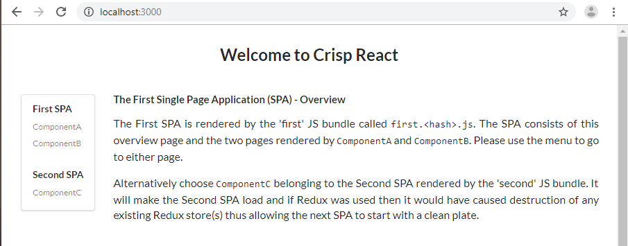

<div align="center">
  <a href="https://github.com/winwiz1/crisp-react">
    
  </a>
  <br />
  <br />
</div>
<br />
<div align="center">
  
  
  
  
</div>

## Project Highlights
* Performance. A script bundle with size 3.5 MB in development cut to ~70 KB in production.
* Backend implements HTTP caching that further enhances performance yet supports smooth deployment of versioning changes in production.
* Ability to optionally split your React Application into multiple Single Page Applications (SPA). For example, one SPA can offer an introductory set of screens for the first-time user or handle login. Another SPA could implement the rest of the application, except for Auditing or Reporting that can be catered for by yet another SPA.
* Seamless debugging. Debug a minified/obfuscated, compressed production bundle and put breakpoints in its TypeScript code using both VS Code and Chrome DevTools. Development build debugging: put breakpoints in the client and backend code and debug both simultaneously using a single instance of VS Code.
* Containerisation. Docker multi-staged build is used to ensure the backend run-time environment doesn't contain the client build-time dependencies e.g. `client/node_modules/`. It improves security and reduces container's storage footprint.

## Table of Contents
- [Getting Started](#getting-started) 
- [Features](#features)
  - [Client and Backend Subprojects](#client-and-backend-subprojects)
  - [SPA Configuration](#spa-configuration)
  - [Integration with UI and CSS Libraries](#integration-with-ui-and-css-libraries)
  - [Testing](#testing)
- [Usage](#usage)
  - [Client Usage Scenarios](#client-usage-scenarios)
  - [Backend Usage Scenarios](#backend-usage-scenarios)
- [Containerisation](#containerisation)
- [What's Next and Pitfall Avoidance](#whats-next-and-pitfall-avoidance)
- [Q & A](#q--a)
- [License](#license)

## Getting Started
Install `yarn` if it's not already installed: `npm install yarn -g`

<div>
  <details>
    <summary><strong>With VS Code</strong></summary>
    <br />
    Prerequisites: Chrome and VS Code with 'Debugger for Chrome' extension.<br />
    <ul>
      <li>Clone the <code>crisp-react</code> repository:<br/>
        <br/>
        <code>git clone https://github.com/winwiz1/crisp-react.git</code><br/>
        <code>cd crisp-react</code><br/>
        <br/>
      </li>
      <li>Install dependencies:
        <p>
          <code>yarn install</code>
        </p>
      </li>
      <li>Open the workspace file in VS Code:
        <p>
          <code>code ./crisp-react.code-workspace</code>
        </p>
      </li>
      <li>Start the debugging configuration <code>'Debug Client and Backend (workspace)'</code>.</li>
      <br/>
      <li>Wait until an instance of Chrome starts. You should see this page:
        <p>
          
        </p>
        <br/>
      </li>
      <li>Stop the running debugging configuration (use the 'Stop' button on VS Code Debugging toolbar two times or press <code>Control+F5</code> twice).</li>
    </ul>
  </details>
</div>
<div>
  <details>
    <summary><strong>Without VS Code</strong></summary>
    <br />
    After executing the following commands:<br/>
	<br/>
    <code>  git clone https://github.com/winwiz1/crisp-react.git</code><br/>
    <code>  cd crisp-react</code><br/>
    <code>  yarn install && yarn start:prod</code><br/>
    <br/>
    you will have a running instance of backend (e.g. Express) serving the newly built React app that can be seen by pointing a browser to <code>localhost:3000</code>.<br/>
    Terminate the backend by pressing <code>Control+C</code>.
  </details>
</div>

## Features
### Client and Backend Subprojects
Each subproject supports execution of the following commands/scripts:
```
yarn compile
yarn lint
yarn test
yarn dev
```
along with additional commands described in [Usage](#usage).

The client subproject:
 * Starts webpack-dev-server listening on port 8080 in the development mode.
 * Creates build artifacts (html files, script bundles and source maps) in the production mode. The artifacts are meant to be copied over to the backend subproject to be served by Express.
 * Additionally can start an instance of Chrome controlled via Inspector protocol (with caching disabled for better debugging) and point it to either webpack-dev-server or the backend server.
> webpack-dev-server can be referred to as 'devserver'.

The backend subproject:
 * In the production mode starts Express listening on port 3000 to serve from disk the build artifacts created by the client subproject .
 * In the development mode starts Express listening on the same port and working as a proxy for webpack-dev-server.
 * Implements HTTP caching arrangement which disables the caching for .html files and enables it for script bundles. A typical React application comes with .html files that are rather small whereas the bundles can be significantly larger. On the other hand, the build process keeps the names of .html files static and embeds a hash into the names of script bundles. As a result the caching arrangement ensures smooth deployment of versioning changes.
### SPA Configuration
The optional splitting of a React application into multiple SPAs (each rendered by its own bundle) improves the application  loading time. It also brings development/testing benefits for medium to large applications. The `vendor` bundle contains `node_modules/` dependencies and is reused between SPAs so that there is no need to download it again when switching from one SPA to another.

Every SPA has a landing page displayed during initial rendering by the component included into the SPA. In webpack terminology such a component is called entry point. An SPA (and its bundle) is comprised of this component, the components it imports and their dependencies. Let's see how Crisp React defines the SPAs.

The client subproject builds an application with SPAs defined by the SPA Configuration block in the `client/config/spa.config.js` file:
```js
/****************** Start SPA Configuration ******************/
  var SPAs = [
    new SPA({
      name: "first",
      entryPoint: "./src/entrypoints/first.tsx",
      redirect: true
    }),
    new SPA({
      name: "second",
      entryPoint: "./src/entrypoints/second.tsx",
      redirect: false
    })
  ];
  SPAs.appTitle = "Crisp React";
/****************** End SPA Configuration ******************/
```
Each SPA is defined using 3 pieces of data: name, entry point (e.g. the landing page component) and a boolean flag. Ignore the flag for a moment. There is also an `appTitle`, it provides the application-wide default setting for the `<title>` tag in the `<head>` section of all pages. The title can be easily overwritten as needed.

SPA's name "first" is used to define the SPA's landing page e.g. `/first.html` and name the bundle that renders the SPA: `first<hash>.js`. More information about all the data pieces shown above is provided in the configuration file. The file is copied during the backend build from one subproject to another and used to configure the client, the backend and the unit tests.

To reconfigure the application to have a separate SPA for login and another one for the rest of the application, change the SPA Configuration block as follows:
```js
/****************** Start SPA Configuration ******************/
  var SPAs = [
    new SPA({
      name: "login",
      entryPoint: "./src/entrypoints/login.tsx",
      redirect: false
    }),
    new SPA({
      name: "app",
      entryPoint: "./src/entrypoints/app.tsx",
      redirect: true
    })
  ];
  SPAs.appTitle = "DemoApp";
/****************** End SPA Configuration ******************/
```
and then follow the instructions provided in the configuration file comments.

Since any SPA is comprised of the landing page component (entry point) and its imports, the coding to support the SPA reconfiguration above can start by making `login.tsx` render the login page: either directly or maybe with the help of an imported component that will ask for user credentials. Another component could render a page asking for alternative credentials e.g. biometrics or ask for multifactor authentication (MFA). 

The entry point `app.tsx` would import the component responsible for rendering the page presented to the user after logging in. Express could potentially be modified to ensure only authenticated users can download the bundle for this SPA.

The newly written `app.tsx` should verify the client is logged in (for example by checking the cookie set by backend after successful login) and if not redirect to the landing page of the 'login' SPA: `/login.html`. In the same manner `login.tsx` should check if the client has been authenticated and if so redirect to `/app.html`. 

No modifications are required for the backend which will be reconfigured to:
* Serve the two HTML pages, namely `/login.html` and `/app.html`, which are the landing pages of our two SPAs.
* Redirect to `/app.html` (due to the boolean `redirect` flag set) other requests in the form `/<path>` or `/<path>.html` provided the `<path>` doesn't include a subdirectory. It's the standard behavior required by all SPAs and implemented in webpack-dev-server using the `historyApiFallback` setting.
* Return 404 error for all other requests except for script bundles and source maps.

To turn off code splitting using multiple SPAs simply leave one SPA in the SPA Configuration block.

> Tip: Let's assume over the time the application has grown and acquired extensive reporting capabilities, perhaps with a reporting dashboard that imports many components. In this case the third SPA and its entry point `reporting.tsx` can be added to the SPA Configuration block. The entry point would import the dashboard and use it for rendering. Such an addition would take little time but bring performance and development/testing benefits. For example, some tests can focus on a React application which has the reporting SPA as the only entry in the SPA Configuration block thus taking the rest of the application (with dependencies on backend API endpoints) out of the testing scope.
### Integration with UI and CSS Libraries
Both libraries ([Semantic UI](https://react.semantic-ui.com) and [Typestyle](https://typestyle.github.io) respectively) provide React with the type safety afforded by Typescript.
### Testing
Debuggable test cases written in Typescript. Integration with [React Testing Library](https://testing-library.com/docs/react-testing-library/intro) on the client and [Supertest](https://github.com/visionmedia/supertest) on the backend. Both using [Jest](https://jestjs.io/) as an engine.<br/>
The client and backend can be tested independently by executing the `yarn test` command. Alternatively the same command can be executed at the workspace level.

The repository is integrated with Travis CI and the test outcome is reflected by the test badge.

## Usage
The Usage Scenarios below are grouped depending on whether  the client or the backend subproject is used. 
>Tip: This section can be skipped at first reading. You can proceed to the [next](#containerisation) section.

The expression "backend data" that is "required" in some scenarios below and "not needed" in others refers to the data supplied via future backend API endpoint. In other words this data is some 'extra' that Express will provide but webpack-dev-server won't. For example, data retrieved from a cloud service which the client cannot touch directly.

> Tip: The commands executed in VS Code Terminal can also be executed from a command or shell prompt in the relevant directory and vice versa.

In case there are any changes made to the SPA Configuration block and the changes are recent (e.g. no client and backend builds have been performed since then), execute the `yarn build` command at the workspace level before starting the debugging configurations described below in the Client and Server Usage sections.

### Client Usage Scenarios
To start with client scenarios open the `client` subdirectory in VS Code. Then open the Terminal. 
#### Run devserver and use Live Reloading
Execute in Terminal: `yarn dev`. Wait until the command finishes.<br/>
Start a browser and point it to `localhost:8080`. You should see the First SPA overview page.<br/>
VS Code: Open `src/components/Overview.tsx` and alter the text on the page. As you type, note the compilation progress in the Terminal followed by automatic browser refresh. The newly typed content should be shown on the overview page. If instead of starting a browser you used already running instance, then you might need to refresh the browser to get Live Reloading working.<br/>
To finish press `Control+C` in the Terminal.<br/>
When to use: Develop the part of UI that doesn't need backend data. 
#### Debug client using devserver and VS Code
VS Code: Start the `Launch Chrome Connected to Devserver` debugging configuration.<br/> 
Wait until an instance of Chrome starts and shows the overview page.<br/>
VS Code: Put a breakpoint on the following line: `src/components/ComponentB.tsx:14`.<br/>
Use the overview page menu to choose the ComponentB. The breakpoint in VS Code will be hit. Press F5 to continue execution. Alternatively use Chrome to continue execution. Note Live Reloading is supported.<br/>
To finish remove the breakpoint and stop the running debugging configuration (use Debugging toolbar or press `Shift+F5`).<br/>
When to use: Troubleshoot the client provided backend data is not required.
#### Debug client using devserver and Chrome DevTools
Follow the "Debug client using devserver and VS Code" scenario  to see the overview page.<br/>
In the instance of Chrome started, open Chrome DevTools.<br/>
Use 'Sources -> Filesystem -> Add folder to workspace' to add `client/src` directory. In this directory open the file `src/components/ComponentB.tsx` and put a breakpoint on the line 14.<br/>
Use the overview page menu to choose the ComponentB. The breakpoint in Chrome DevTools will be hit. Go to VS Code and note it knows the execution has stopped on this line of code and lets you inspect variables. Use Chrome or VS Code to continue execution. Note Live Reloading is supported.<br/>
To finish remove the breakpoint and stop the running debugging configuration (use Debugging toolbar or press `Shift+F5`).<br/>
When to use: Troubleshoot UI, inspect DOM tree, etc. provided backend data is not required.
#### Build client for development or production
To perform the development build execute in Terminal: `yarn build`. The build artifacts can be found under `client/dist` directory.<br/>
To perform the production build execute in Terminal: `yarn build:prod`. The build artifacts including the bundles with various compressions can be found under the same directory. If a bundle is too small to benefit from compression then it won't be compressed.<br/>
When to use: As a preparatory step when the backend is required. This step will be executed automatically by the backend usage scenarios below when needed.
#### Test client
Terminal: `yarn test`
#### Debug client test cases
VS Code: Put a breakpoint in any `.test.tsx` file.<br/>
VS Code: Start 'Debug Jest Tests' debugging configuration. Wait until the breakpoint is hit.<br/>
To finish remove the breakpoint and stop the running debugging configuration (use Debugging toolbar or press `Shift+F5`).
#### Lint client
Terminal: `yarn lint`
### Backend Usage Scenarios
#### Build backend in production mode
Open a command prompt in the directory containing the workspace file `crisp-react.code-workspace` .<br/>
Execute command: `yarn build:prod`.<br/>
When to use: Prior to backend deployment, for example before copying the backend to the filesystem of a Docker container.
#### Run backend in production mode
Open a command prompt in the directory containing the workspace file `crisp-react.code-workspace` .<br/>
Execute command: `yarn start:prod`. It will build both the client application and the backend.<br/>
To stop the backend terminate the running command e.g. press `Control+C`.
#### Run backend with Live Reloading
Open the workspace file  `crisp-react.code-workspace`  in VS Code.<br/>
Start the debugging configuration  `Debug Client and Backend (workspace)`.<br/>
Wait until an instance of Chrome starts. You should see the overview page.<br/>
VS Code: Open `client/src/components/Overview.tsx` and alter the text on the page. After a few seconds delay the new content should be shown in the browser.<br/>
To finish stop the running debugging configuration (use the ‘Stop’ button on VS Code Debugging toolbar two times or press  <code>Control+F5</code>  twice).
#### Test backend
Open a command prompt in the `server` subdirectory.<br/>
Execute command: `yarn test`
#### Debug backend test cases
Open the `server` subdirectory in VS Code.<br />
Put a breakpoint in `.test.tsx` file.<br/>
Start 'Debug Jest Tests' debugging configuration. Wait until the breakpoint is hit.<br/>
To finish remove the breakpoint and stop the running debugging configuration.
#### Lint backend
Open a command prompt in the `server` subdirectory.<br/>
Execute command: `yarn lint`
#### Debug backend and client simultaneously
Open the workspace file  `crisp-react.code-workspace`  in VS Code.<br/>
Start the debugging configuration  `Debug Client and Backend (workspace)`.<br/>
Wait until an instance of Chrome starts. You should see the overview page.<br/>

<div>
  <details>
    <summary>Using VS Code example:</summary>
    <br/>
Note that VS Code can mark a breakpoint with a circle that is grey and hollow rather than red and solid, referring to it as 'Unverified breakpoint'. You can check the breakpoint has been set and marked with solid red circle by highlighting the relevant process (client or server) on VS Code Debug sidebar in the CALL STACK view.<br/>
    <br/>
Put a breakpoint on the following line:  <code>server/src/Server.ts:59</code>.<br/>
In the browser choose the ComponentC from the menu, the breakpoint will be hit. Remove the breakpoint and resume the execution.<br/>
Put a breakpoint on the line <code>client/src/components/ComponentB.tsx:14</code>.<br/>
Use the menu to go back to the First SPA and then choose the ComponentB. The breakpoint will be hit. Remove the breakpoint and resume the execution. Choose the ComponentA from the menu.<br/>
  </details>
</div>
<div>
    <details>
      <summary>Using Chrome DevTools example:</summary>
      <br />
      In the instance of Chrome started, open Chrome DevTools.<br/>
Use 'Sources -> Filesystem -> Add folder to workspace' to add <code>client/src</code> directory. In this directory open the file <code>src/components/ComponentB.tsx</code> and put a breakpoint on line 14.<br/>
Use the overview page menu to choose the ComponentB. The breakpoint in Chrome DevTools will be hit. Remove the breakpoint and use Chrome or VS Code to continue execution.
</details>
</div>

To finish stop the running debugging configuration (use the ‘Stop’ button on VS Code Debugging toolbar two times or press  <code>Control+F5</code>  twice).
#### Use backend to debug the production client build
Open the workspace file  `crisp-react.code-workspace`  in VS Code.<br/>
Edit file `client/webpack.config.js` to change the `sourceMap` setting of the TerserPlugin config to `true`.<br/>
Start the debugging configuration  `Debug Production Client and Backend (workspace)`.<br/>
Wait until an instance of Chrome starts. You should see the overview page. Now you can use VS Code to set breakpoints in both client and backend provided the relevant process is highlighted/selected as explained in the previous scenario. You can also use Chrome DevTools to debug the client application as shown above.<br/>
To finish stop the running debugging configuration (use the Debugging toolbar or press  `Control+F5`  once).
## Containerisation
To build and run a Docker container execute [`start-container.cmd`](https://github.com/winwiz1/crisp-react/blob/master/start-container.cmd) or [`start-container.sh`](https://github.com/winwiz1/crisp-react/blob/master/start-container.sh). The file can also be executed from an empty directory in which case uncomment the two lines at the top.

Moreover, it can be copied to a computer or VM that doesn't have NodeJS installed. The only prerequisites are Docker and Git.
## What's Next and Pitfall Avoidance
* Start with [Client Usage Scenarios](#client-usage-scenarios) to develop UI in absence of API data. For example, develop the initial look and feel of the login page. Take advantage of the Live Reloading to speed up the development. The client scenarios ensure the backend is not started needlessly.
*  Implement an API endpoint in the backend. For example, a login endpoint.
*  Switch to [Backend Usage Scenarios](#backend-usage-scenarios) to consume the API endpoint in the client. Keep taking advantage of the Live Reloading that is supported for client and backend code.

One of the goals pursued by the backend scenarios is to avoid the following common pitfalls:
- Running the webpack-dev-server in production,
- Getting CORS security violations triggered by the browser which detects that script bundles were downloaded from one server and then the code from the bundles attempts to call API endpoints provided by another server.

 The backend scenarios ensure the client gets everything (build artifacts including script bundles, API responses) from the backend only. This leaves no room for CORS issues.

The webpack-dev-server is never started in production. This is hardly a good idea. The server, as its name suggests, is meant to be used in development only.
## Q & A
Q: I have changed both SPA names in the SPA Configuration block and kept the rest including the entry points intact. I expect everything to keep working using my new names for the SPA landing pages instead of the old `/first.html` and `second.html`.  However navigation via the menu and Back/Forward browser buttons seems to be broken. How can it be fixed.<br/>
A: Clear the browser's history and cache. Alternatively use an incognito tab. The client, the backend and the tests should work with the new names.

Q: Can I use dynamic imports in addition to multiple SPAs for code splitting?<br/>
A: Yes, dynamic imports are fully supported. For example, if there is a Reporting bundle and one component is known to be used infrequently, then it's a good candidate to be separated from the bundle using dynamic import:
```js
const ReportingWrapperXXX = React.lazy(() => import(
  /* webpackChunkName: "reporting-xxx" */
  /* webpackMode: "lazy" */
  /* webpackPrefetch: "false" */
  '<path>/InfrequentReporting'
));
...
// Can have its own Redux store to coexist with the main Redux store
export const ReportingPanelXXX: React.FC = _props => {
  return (
    <Provider store={reportingStoreXXX}>
      <React.Suspense fallback={<div>Loading...</div>}>
        <ReportingWrapperXXX />
      </React.Suspense>
    </Provider>
  );
}
```
Remember to change the settings in `tsconfig.json`:
```
"removeComments": false,
"module": "esnext",
```
 otherwise the dynamic import will be ignored and webpack 'magic comments' removed.
 
 > Note: `React.lazy` has a restriction, it works with default exports only. The restriction should be lifted in the future. When webpack detects dynamic imports, it emits code that loads the bundle it created asynchronously and `Suspense/lazy` needs to wait for the loading to complete. This technology is less straightforward and probably less mature than building a static bundle and referencing it via the `<script>` tag  in .html file.

Q: Do dynamic imports negate the need to have multiple SPAs.<br/>
A: It depends. These two are complimentary techniques. Obviously once a bundle grows larger, it starts affecting performance as its loading time increases. But the reverse is also true, having too many small bundles could result in more network round-trips and the bundle compression will become less efficient. It can also complicate attempts to scrutinise network traffic including requests for bundles.

Q: I use Apache/IIS/ASP.NET Core, not Express. Can I use the client project and what needs to be changed?<br/>
A: Yes you can. The client project located in the `client` subdirectory is fully self-contained and can be used without any changes. The client related usage scenarios do not require any modifications.

Q: The client project does not have .html file(s). How can I add my own HTML?<br/>
A: You can add .html snippet file to the project and change the `HtmlWebpackPlugin` configuration in `webpack.config.js` to include the content of your snippet into the generated .html files. That's how you would include polyfills etc. Look for the [headHtmlSnippet](https://github.com/jaketrent/html-webpack-template) configuration setting (and the bodyHtmlSnippet setting), it accepts a name of .html file. 

Q: How can I fix Typescript compilation errors?<br/>
A: Note the Typescript version in `package.json`. Ensure the Typescript version shown at the VS Code status bar when .ts or .tsx file is opened is not lower.

Q: Breakpoints in Chrome DevTools are not hit. How can I fix it?<br/>
A: Open the Settings page of the Chrome DevTools and ensure 'Enable JavaScript source maps' and 'Disable cache (while DevTools is open)' boxes are ticked. Close the Settings page and on the Network tab tick the 'Disable cache' box. If debugging a production build, change the `sourceMap` setting of the TerserPlugin config to `true` in `webpack.config.js`, then restart debugging.

Q: Breakpoints in VS Code are not hit. How can it be fixed.<br/>
A: Try to remove the breakpoint and set it again. If the breakpoint is in the client code, refresh the page.

Q: Linting the client and the backend yields a couple of errors. How do I fix it?<br/>
A: The linting errors left unfixed are either erroneous or are considered to be harmless and not worth fixing until the planned transition from tslint to eslint is completed.
## License
Crisp React project with its 'server' and 'client' subprojects is open source software [licensed as MIT](./LICENSE).
