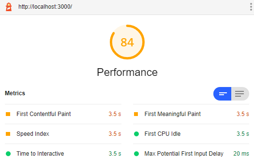

## Performance
This section can be skipped at first reading. You might prefer go back to the [README](../../README.md).
### Benchmarks
To benchmark the solution perform the following steps:

1. If the [Getting Started](../../README.md#getting-started) section has been completed, skip this step. Otherwise clone the repository and build the solution:
    ```
    git clone https://github.com/winwiz1/crisp-react.git
    cd crisp-react
    yarn install && yarn build:prod
    ```
2. Start the backend:
    ```
    yarn run:prod
    ```

3. Start Chrome and open new incognito window to disable extensions. Point it to `localhost:3000.`  The Overview page should appear.

4. Press F12 to open Chrome DevTools, then activate the `Audits` tab. Choose the settings:
    ```
    Device: Desktop
    Audits: Performance
    Throttling: No throttling
    Clear storage: ticked
   ```
5. Run the audit. Then change `Throttling` to `Simulated Slow 4G, 4x CPU Slowdown` and run the audit again. The results should be similar to shown in the table:

    | Throttling | Benchmark Results |
    | :---:| :---:|
    | not throttled |  |
    | throttled to slow 4G,<br/>CPU slowdown |  |

    As you can see, throttling results in 16% performance drop only. Switching from Desktop to Mobile produces slightly longer First Meaningful Paint and other metrics with the same performance scores.

6. Terminate the backend by pressing `Control+C`.

### Scalability
In theory scalability refers to the ability of the software to manage increased workload. Let's define it in practical terms and with respect to our React application integrated with Express.

>In production scenarios scalability would depend on many factors. E.g. can the solution scale up and take advantage of more powerful CPU by uniformly engaging all its cores under stress load using multiple threads. Or can the solution scale out by starting additional processes/instances and handling distributed state changes. However we will use a simplified definition of scalability that is more straightforward yet meaningful and depends on how heavily the React application taxes a webserver.

Suppose the application is an online timesheet deployed at a company where everyone uses it at the beginning of a workday. If the timesheet is containerised and deployed in the cloud, for example using Google Cloud Run, then it can handle between 40 (the default) and 80 (the [maximum](https://cloud.google.com/run/quotas) Google allows) requests concurrently. Let's assume we have set the concurrency setting to __50 requests__. Now we can provide a simplified definition of scalability: it's the number of concurrent timesheet startup/download requests a single Cloud Run container can serve at one point of time (aka burst rate). It can help to decide how many containers are required if CDN is not used for React application deployment.

To find out this number press F12 to open Chrome DevTools, then switch to the `Network` tab and press F5 to refresh the Overview page. Counting the number of requests served by the backend should yield __5 requests__ (one .html page, three script bundles and one icon). Therefore the scalability figure is 50 requests / 5 requests = __10 applications__.

> The backend deals with API requests as well but those will need to be served at the different points of time.

If the React app contains multiple SPAs, then switching from one SPA to another results in 2 requests served by the backend (one .html page and one script bundle). Such a switching will be barely noticeable by a user if the bundle size containment described in the next section is implemented.

### Future Considerations
The solution has a limited amount of code, as a boilerplate should. It begs a question to what extent the performance will be affected when the application grows. To contemplate an answer let's have a look at the script bundles:

| Bundle | Description | Brotli-compressed size in production build / development build size
| :---:| :---| :---:|
| `first.<hash>.js` | Renders the SPA called 'first' | 6 Kb / 64 Kb |
| `second.<hash>.js` | Renders the SPA called 'second' | 8 Kb / 24 KB |
| `vendor.<hash>.js` | Contains dependencies from `client/node_modules/`. Reused among SPAs.  | 77 Kb / 3.6 MB|
| `runtime.<hash>.js` | Webpack utility bundle. Contains internal webpack code. Reused among SPAs. | 2 Kb / 7 Kb |

>Sidenote. The bundles are located in the `client/dist` directory created during builds. We take Brotli compression (with `.br` file extension) into account because on the one hand it delivers approximately 17% better compression than gzip and on the other hand all modern browsers support it and have supported it for quite a while. Some bundles are too small to benefit from compression and are left uncompressed in which case we take the uncompressed size. 

>To inspect bundle sizes in different builds, switch between development and production by executing `yarn build` or `yarn build:prod` from the `client/` subdirectory.

Let's assume that at the beginning of the development the second SPA and its bundle were removed (by commenting it out in the SPA Configuration) so the React app contains a single SPA only called 'first'. With the anticipated application growth the `first` bundle is expected to grow rapidly to reflect the expanding functionality and codebase. The `vendor` bundle is expected to grow at much slower pace because it already contains the bulk of dependencies (project dependencies including the React library, its direct dependencies, dependencies of the dependencies and so forth).

No substantial impact on the performance can be anticipated until the `first` bundle reaches the size and then outgrowths the `vendor` bundle. At this point it might be a good time to use code splitting and introduce another SPA. One of the goals of using multiple SPAs is to ensure each SPA is rendered by its own and smaller bundle thus reducing React application loading time. See [SPA Configuration](../../README.md#spa-configuration) section for more details.

> Code splitting using multiple SPAs can be introduced much earlier due to considerations related to distributing the development workload among several teams, IP rights protection and security (e.g. to ensure that non-authenticated users can download the Login bundle only).

The conclusion is that with multiple SPAs you can grow the functionality and codebase while maintaining the top performance due to bundle size containment.

---
Back to the [README](../../README.md).
