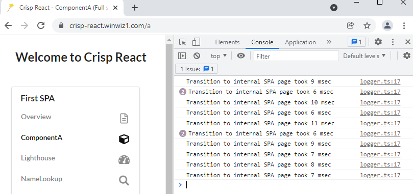

# Performance
The purpose of this section is to provide an overview of the most widely used rendering techniques, explain why prerendering coupled with SPA/CSR provides the best option for many, but not all websites and demonstrate benchmark results.

Counter to the widely held belief that run-time SSR is always superior to CSR in terms of performance, this section reveals the real picture is more nuanced.

The digest of this section is provided below. It is followed by the two detailed subsections, namely [Rendering Techniques](#rendering-techniques) and [Benchmarks](#benchmarks).
### Landing/Index Page
Run-time SSR outperforms any other rendering technique for a dynamic landing/index page. However, if the landing page is static e.g. doesn't need API data for rendering, then build-time SSR (prerendering) is a better overall choice because run-time SSR comes at a cost.
### Non-landing/Non-index Pages
CSR frequently delivers the best performance for static pages.

The choice of the best rendering technology for dynamic pages is complex, it depends. For some websites run-time SSR would be most performant, for other CSR would deliver the best speed. In cases when CSR and run-time SSR deliver similar performance or when SSR wins by a small margin, CSR could still be the best overall choice after the SSR price tag is accounted for. The tag is related to vendor lock-in, scalability and/or monetary cost along with susceptibility to Layer 7 DDoS attacks. The attacks could have a significant amplification factor that needs to be looked at.
### Summary
The performance advantage delivered by run-time SSR should not be taken for granted, unless a dynamic landing/index page is considered. The advantage has to be substantiated and preferably quantified for the given website.
## Rendering Techniques
The three major rendering techniques are considered: run-time SSR, CSR used by SPA and build-time SSR (prerendering).
### Run-time SSR
Also known as SSR. As the name suggests, the rendering is performed at the server and at the run time, in response to a client request.  When rendering is completed, the HTML markup for the page (generated individually for the given client) is sent back. The slogan of run-time SSR could be _"Personalisation for everyone"_.
#### Advantages
The indisputable advantage of run-time SSR for a dynamic landing page comes from it ability to reduce the number of network round-trips required to render such a page. A prerendered page would need two downloads performed one after another: Firstly download the page markup along with the script and secondly let the script fetch API data at the expense of another trip. Run-time SSR allows to fetch API data and use it to generate the HTML markup on the server, then send it to the client so that only one download is required.

The advantage related to cutting down the count of network trips doesn't apply to other e.g. non-index pages because when a transition to such pages occurs, the script capable of rendering the next page is already running and should be able to download all the data it needs for CSR in one trip. As a result, the performance analysis shifts from network trip count to the CSR vs SSR timing in the single trip scenario.
#### Disadvantages
1. Scalability and/or monetary cost.<br/>
The personalisation is a major advantage when needed but it comes at a cost because HTML generation is a CPU intensive and potentially lengthy task performed by a single server thread calling React's `renderToString` function.

    If the number of server threads is limited, then scalability (e.g. capacity to serve many clients simultaneously) gets a hit due server threads getting bogged down inside synchronous CPU intensive tasks. That is, scalability initially constrained by the limited number of server threads, is reduced even further.

    Now let's consider the case of a highly scalable deployment with the number of server threads either unlimited or in practice capped at some large count, could be in thousands. In this case the cloud vendor that underpins the deployment will happily make more threads available for your server when the concurrent workload grows. Technically this can be done by spinning off more containers, isolates or cloud function instances.

    The bottomline for this case is that someone has to pay for it. If the cost is not an issue because you have a free or low cost SSR deployment, then it could mean there is a cap on the number of server threads or a limit on the count of thread invocations over some timeframe to prevent the server rendering from becoming unbounded. In other words, SSR as a rendering technology comes with a price tag related to scalability and/or cost.

2. Security<br/>
In case when scalability is restricted by the limited number of available server threads (e.g. a few dozen), then from security standpoint it turns the deployment with such server into an invitation to mount a Level 7 DDoS attack aimed at the server CPU exhaustion.

    When the deployment is scalable with the number of server threads unbounded or in thousands, then from security standpoint this deployment amounts to an invitation to mount a Level 7 DDoS attack aimed at exerting a high monetary cost. The more verbose/lengthy HTML markup is sent back, the greater the amplification factor of the attack will be.

    The consideration above could be applied to any server or any API endpoint. However the amplification factor of the attack will be smaller if run-time SSR is not used. Many API endpoints simply call a cloud database using async/await so no CPU time is wasted on waiting for the database call to complete. The CPU is then used to copy the data fetched from one buffer to another  before sending the response back to the client. Depending on the nature of the data, the copying task could take drastically less CPU time than HTML markup generation for each data piece. The buffer-copying paradigm wouldn’t apply to GraphQL endpoints known for a large number of requests sent to the database layer in response to a single API call and therefore requiring additional security considerations before deployments.

3. Inability to use CDN<br/>
Caching of static pages, typically performed by a CDN, cannot be used: the pages are personalised and therefore dynamic e.g. changing from one client to another. Lack of CDN usually has major security and performance implications. The latter are caused by the sharply increased TTFB, more about it in the [next](#spa--csr) subsection.

    > This could change in the future if Cloudflare makes its datacenters available for SSR content generation.

4. Vendor lock-in.<br/>
Practical use of run-time SSR implies a framework that facilitates it. The run-time SSR frameworks are frequently referred to as opinionated. The frameworks usually require certain programming constructs (like properties, data fetching hooks) to be used in the React components.  It translates into the loss of code portability.

    Also the frameworks come with lots of other functionality and depending on the circumstances this can be perceived as either advantage or liability, more about it [here](../WhenToUse.md#:~:text=Crisp%20React%20can%20help%20to).

#### Questions to ask
The scalability and security issues described above suggest some questions. If the backend of your deployment is managed by a provider (for free or at a cost), then open Chrome DevTools and ensure that on the Networking tab the 'Disable cache' checkbox is ticked. Then go to the landing/index page of your website. If already there, refresh the page. Count the number of resources e.g. scripts, images, stylesheets etc. fetched by the browser. Suppose the count is 20. Then consider asking your provider the following questions:

* If getting my index page triggers 20 downloads, then how many concurrent clients from the same city/region can access my website?
*  Suppose an attacker writes a script to request my index page in a loop and runs it on several computers. Do you have DDoS mitigation that will protect my site in this case?
* Suppose the attacker adds a delay of a few seconds between requests. Will DDoS protection still shield my site? Is there a daily or monthly limit on a number of requests that can be reached in this scenario? If so then what will happen to my site for the remainder of that day or month?
* Suppose the attacker requests all the 20 resources instead of the index page only and then pauses before the next request. How would it change answers to the above questions?
* If some limits are reached then will my customers need to solve CAPTCHAs generated by you? If so then do your CAPTCHAs meet the accessibility requirements in my country?

#### Misconceptions
Misconception:<br/>
Run-time SSR is more performant not only for dynamic landing pages but also for other pages because the server CPU is much more powerful and can perform rendering much faster comparing to a client.

Reality:<br/>
If a page is static e.g. its content is known at the build time, then HTML markup generated at and downloaded from a server points to a grossly suboptimal solution. The markup can be either generated by CSR (see the benchmarks) or downloaded from a CDN to keep the TTFB low.

If a page is dynamic e.g. it requires API call(s), then the comparison becomes more complex. It requires 4 pieces of data:
* Server rendering time,
* Client rendering time,
* The compressed size of the HTML markup generated on the server and sent to a client in the run-time SSR case,
* The compressed size of the API response sent to a client in the opposite e.g. SPA/CSR case.

Then one can decide on the network speed chosen for a comparison (e.g. 5G, Fast 3G etc.) and calculate to what extent the benefit of the presumably faster server rendering is offset by the presumably bigger HTML download.

In the run-time SSR case, a provider is unlikely to provision compute-optimized VMs due to the increased cost. General purpose VMs are more likely to be used instead. The performance gain in the SSR case won't be drastic, e.g. orders of magnitude, due to both the server and the client running on a single digit GHz CPU and not using multithreading. On the other hand, if a page contains some tabular data of a numeric nature, then the raw data in the API response could take less bandwidth in comparison with more verbose HTML markup that wraps that data around. So the rendering gain on the server could be offset by a larger download. Admittedly such an offset will not apply to a predominantly text based page like a blog etc. Therefore it depends and warrants some benchmarking for a particular site or page. An incomplete (not all the 4 pieces of data are provided) but still giving a lot of food for thought benchmarking is provided later in this section.

Misconception:<br/>
Some pages require several API calls to be made to the data layer endpoints (e.g. cloud databases etc.). The run-time SSR server located in the same cloud is much better positioned to make such calls in comparison to a client browser. So the server makes the fast cloud-to-cloud API calls, processes the data fetched and uses it to generate HTML markup on the server. The same API calls would take more time is made by a client.

Reality:<br/>
There are Jamstack deployments where clients make direct calls to cloud API endpoints because there is no full stack backend. [This](https://jamstack.winwiz1.com) demo website is an example. And there are full stack deployments like [that](https://crisp-react.winwiz1.com) demo website or the [production](https://virusquery.com) site where clients get React app build artifacts like HTML files, script bundles and API responses from the same backend server.

The misconception correctly considers the run-time SSR case with a client downloading API data embedded into HTML that wraps the data around, for instance inside HTML table. That occurs during one download from the SSR backend. Then the misconception mistakenly implies that the other, e.g. non-SSR scenario, amounts to having a Jamstack deployment. A fair consideration would consider the non-SSR case represented by a full stack deployment instead, where the client downloads the same API data but without its HTML wrapping in one single download as well. In which case the full stack backend acts as an API endpoint and aggregates the API calls if necessary while shielding the client from details related to getting data from endpoints exposed by the data layer.
#### Conclusion
* The personalisation advantage is significant and there are websites that need it as mentioned at the beginning of [this section](../WhenToUse.md#when-to-use). When the landing page is dynamic, nothing will replace a run-time SSR framework and the deployment it facilitates. However the advantage translates into a more demanding deployment.
* The scope of this advantage could be limited and include the landing page only. If the landing (or maybe login) page is not dynamic while the other pages are, then there might be no need to use run-time SSR and deal with its challenges or costs. Other technologies such as SPA or build-time SSR (prerendering) could be a better fit.
* If a website is static (e.g. a portfolio website) so that its content is largely known at the build time and the ongoing changes can be reflected via website rebuilds, then run-time SSR is unlikely to be the optimal choice since its costs are becoming hard to justify. Unless the complementary functionality brought in by opinionated SSR frameworks is important while the downside is not.

### SPA / CSR
#### Disadvantages
The fundamental performance issue that any SPA suffers from by default is not the Client Side Rendering (CSR) per se but rather the CSR dependency on scripts. A pure SPA has virtually no HTML markup so there is nothing to display except for a blank page - until the scripts are downloaded, parsed and executed to finally build the DOM in browser's memory. The blank page delay is unpleasant to users and Google has statistical data that links loading delays to the percentage of users who abandon websites.

To make matters worse, the delay depends on how big the script bundle is. And the bundle, being a container of the client-side code, grows relentlessly as more functionality is added to the website it renders. Code splitting using lazy loading with dynamic imports usually helps, but to some limited extent only so the problem persists.
#### Advantages
In sharp contrast with the landing page's loading performance, subsequent transitions between pages are very fast. At that time the bundle has already been downloaded, parsed and is executing. It doesn't have to reload the page and completely rebuild its DOM so both `window` and `document` objects stay the same. The transitions from one page to another are effected by the DOM modification. Under the hood React uses [VDOM](https://reactjs.org/docs/faq-internals.html) to effect changes and usually this process is very fast unless the amount of data rendered (and therefore DOM complexity) is extraordinary.
#### Comparisons
Let's compare the page switching delay in SPA with similar delays applicable to non-CSR rendering techniques. 'Non-CSR' means the HTML markup, either prerendered by build-time SSR or generated on the fly by run-time SSR, is fetched from a server. The comparison will apply to pages that do not require API data.

For a SPA, an accurate delay measurement can be provided, see the [Page Switching Performance](#page-switching-performance) heading below. As for the non-CSR case, the delay depends on a network trip to fetch HTML from the server and the duration of server-side activities. To simplify the task, we can consider a fraction of the page switching delay in the non-CSR case called [TTFB](https://web.dev/time-to-first-byte/). This approach conveniently puts otherwise disperse SSR cases together under one 'non-CSR' umbrella but makes the comparison unfair for the SPA case which gets its full delay compared to a fraction of that for the non-CSR case. However we can afford the unfairness since SPA wins anyway.

The SPA benchmark results and rough TTFB estimations for the non-CSR case are shown in the table:

|Case|Delay|
|:--|:--:|
|SPA/CSR|[6-11 msec](#page-switching-performance).<br/>Hardware dependent,<br/>30-40 msec when a mid-range phone is emulated|
|Non-CSR. Client located in the same city as a CDN datacenter| 50-150 msec|
|Non-CSR. Client located further away from the nearest CDN datacenter|Hundred(s) of milliseconds|
|Non-CSR. CDN not used. SSR server in the same cloud region|Up to ~0.5 sec|
|Non-CSR. CDN not used. SSR server not in the same cloud region|From ~0.5 sec|

> TTFB is visible in Chrome DevTools on the Network tab in green color. If not, select a particular download and choose  the Timing tab.<br/>The TTFB estimations shown do not account for 'bad' cases when a file is evicted from the CDN cache or the SSR server suffers from cold starts.

So far only pages that do not require data have been considered. Comparing SPA vs build-time SSR for pages that require API data is trivial. The table data above applies to loading of both a SPA internal page and a prerendered page making both ready to make an API call. Once the call is made, both pages are in the same boat as far as timings are concerned so no further comparison is necessary. Comparing SPA vs run-time SSR for pages that require API data is complex and requires the 4 pieces of data mentioned in the [previous](#run-time-ssr) subsection.
#### Conclusion
* The loading page performance is an issue caused by the dependency on scripts. The performance gets worse as the website complexity/functionality grows and the script bundle gets bigger.
* Subsequent page transitions are very fast.  The slogan of SPA could be _"Contrasts of performance"_.
* CDN is a must for production SPA deployments. If the CDN comes with unlimited bandwidth and unbound usage then most of the ask-your-provider questions in the previous subsection become moot. It means there are no limits imposed by the rendering technique used and all the limitations on scalability and usage come from the API endpoint only. However some additional deployment limits do apply in case the edge functions/lambdas/workers are used to achieve optional extras e.g. improve SEO etc.
### Build-time SSR
Also called prerendering, static generation, server side generation (SSG).

The rendering takes place at the server during the build time. Therefore each client gets the same page without any personalisation reminiscent of run-time SSR. This avoids loading the webserver CPU at run-time. Also helps to improve scalability and save electricity. The slogan of build-time SSR could be _"Saving the trees"_.

On contrary to SPA, the loading/index page loads faster when prerendered since browsers can start building DOM from the downloaded HTML and possibly render it. All that without much regards to the scripts that are still being downloaded. Therefore, build-time SSR helps to mitigate the SPA loading problem.

On contrary to SPA again, subsequent page switching suffers from network round-trips and is not as fast as in the SPA case.

An astute reader can ask if we can use CSR with build-time SSR to combine the respective advantages and eliminate drawbacks. E.g. have a SPA with its landing page prerendered and other SPA pages generated by the script bundle. The answer to that is Yes. This is possible and that is what Crisp React does. This is the winning combination for many websites that:

* Do not benefit from run-time SSR because their landing page is not dynamic enough.
* Do not benefit from run-time SSR because their non-landing pages can be rendered faster on the server but the benefit is offset by the larger download. Caused by the HTML markup in SSR case taking more bandwidth than API response data in SPA case.
* Do benefit from run-time SSR but the benefit is negated by the limitations on scalability or usage or by costs.

Combining the two rendering techniques together doesn't address another fundamental SPA performance problem: script bundle growth in size. Crisp React resolves this problem by allowing a monolithic React app to be split into multiple SPAs each rendered by its smaller bundle.

> Interestingly enough some opinionated SSR frameworks have demo websites that demonstrate not run-time SSR but rather the same winning combination: SSG for the landing page, SPA/CSR for the rest. This can be verified by using the same Network tab in Chrome: ensure the ‘Disable cache’ checkbox is ticked, then switch the pages and observe that a page switch doesn't trigger any HTML download, only some occasional image etc. gets fetched.

#### Conclusion
* On contrary to SPA, build-time SSR has much better landing page performance while being let down by the necessity to make network trips for non-landing pages.
* Combining prerendering for the landing page with CSR for other pages delivers the best possible performance for websites that do not benefit from run-time SSR, provided the bundle size growth is restricted.

## Benchmarks
All benchmarks are designed to be easily reproduced.
### Page Switching Performance
Goal:<br/>To measure how much time it takes for already loaded script bundle to switch SPA from one page to another.

Scope:<br/>Both demo websites mentioned in [README](../../README.md#seo-and-spa) can be benchmarked. Same applies to the website running on the development machine.

Methodology:<br/>The first timestamp is taken immediately prior to a page switching e.g. before the code that calls `history.push` is invoked. The second timestamp is taken when a React component has loaded and its `useEffect` hook is called. If an async API call is made, then its Promise gets resolved when the API response arrives and at this point of time the first timestamp is taken. The second timestamp is still taken by the `useEffect` hook.

Implementation:<br/> The intrinsic `window.performance` object is used to take measurements so there is no package to install. The two thin [wrapper functions](https://github.com/winwiz1/crisp-react/blob/master/client/src/utils/misc.ts), namely `perfStart` and `perfStop`, are used instead.

How to benchmark:

1. Open Chrome DevTools and navigate to a demo website.
2. In DevTools on the Application tab add the key `loglevel:Crisp React` with the value `INFO` to Local Storage:

    

3. In DevTools open the Console tab. Switch between the pages of the First SPA using the menu and observe performance logging on the Console:

    

    The values are hardware dependent. The screenshot with 6-11 msec delays was taken on 4-years old notebook. The page transition delay increases to 30-40 msec when a mid-range phone is emulated.
### Loading Performance - Online Benchmark
Goal:<br/>To benchmark loading performance of a website using an online tool maintained by Google.

Scope:<br/>Both demo websites mentioned in [README](../../README.md#seo-and-spa) can be benchmarked.

Methodology:<br/>Use [online instance](https://web.dev/measure/) of the Google Lighthouse tool to benchmark a website. The tool emulates a mid-range Moto G4 phone using a slow 3G wireless network and runs on a shared cloud VM. The emulation depends on the VM workload which varies from time to time, affects results and is reflected by the "CPU/Memory Power" metric at the bottom of the performance report.<br/>
Alternatively use [PageSpeed Insights](https://pagespeed.web.dev/), it allows to benchmark against a mobile and a desktop platforms.

The results should be similar to the following:


### Loading Performance - Local Benchmark
Goal:<br/>To benchmark loading performance of the website built on the development machine.

Methodology:<br/>The Lighthouse tool built into the Chrome browser is used.

To benchmark the solution , perform the following steps:

1. If the [Getting Started](https://github.com/winwiz1/crisp-react#getting-started) section has been completed, skip this step. Otherwise clone the repository and build the solution:
    ```
    git clone https://github.com/winwiz1/crisp-react.git
    cd crisp-react
    yarn install && yarn build:prod
    ```
2. Start the backend:
    ```
    yarn run:prod
    ```

3. Start Chrome and open new incognito window or tab to disable extensions. Point it to `localhost:3000.`  The Overview page should appear.

4. Open Chrome DevTools and activate the `Lighthouse` tab with the settings:

    `Simulated throttling: Checked`<br/>
    `Clear storage: Checked`<br/>
    `Device: Desktop`

5. Click on the 'Generate report' button. The results should be similar to the following:

    

7. Terminate the backend by pressing `Control+C`.

### Run-time SSR
SSR was traditionally achieved by calling React's `renderToString` function. If build-time SSR is used, the function is called on the build server to prerender React components into HTML markup. Run-time SSR invokes the same function but unsurprisingly at the run time.  Although this solution doesn't offer run-time SSR, we can still benchmark the time taken by the invocation of this function.

Goal:<br/>To partially benchmark run-time SSR performance by measuring `renderToString` execution time.

Methodology:<br/>Perform a build (with build-time SSR enabled and therefore `renderToString` invoked) on a VM suitable for the webserver role.

The steps to use Google Compute Engine (GCE) VM:

> Google [Cloud Shell](https://cloud.google.com/shell/docs/launching-cloud-shell) is a free VM with Cloud SDK preinstalled. It can be used to perform all the steps without installing any software.

1. Allow access to VMs via Google Identity Aware Proxy (IAP):
    ```
    gcloud compute firewall-rules create allow-ssh-ingress-from-iap --direction=INGRESS --action=allow --rules=tcp:22 --source-ranges=35.235.240.0/20
    ```

    IAP will be used as a very secure (and maintained by Google) jump host that additionally performs credentials checking. The command will apply to the 'Default' VPC unless you specify your custom VPC. It's recommended to ensure that port 22 is closed for access from Internet for the entire chosen VPC.

2. Create a VM:
    ```
    gcloud compute instances create benchmark-ssr --image-family=debian-11 --image-project=debian-cloud --machine-type=n2-standard-2 --zone=us-west1-a --metadata=startup-script="apt update && apt -y install nodejs && apt -y install git && apt -y install npm && npm add yarn --global"
    ```

3. SSH into the VM via IAP:
    ```
    gcloud compute ssh benchmark-ssr --zone us-west1-a --tunnel-through-iap
    ```

4. Execute commands:
    ```
    git clone https://github.com/winwiz1/crisp-react.git
    cd crisp-react
    yarn install && yarn benchmark:SSR
    exit
    ```
    Note the output: `Build-time SSR for SPA 'first' took XX msec`
5. Delete the VM to avoid incurring further charges:
    ```
    gcloud compute instances delete benchmark-ssr --zone us-west1-a
    ```
The step 2 can be modified to use more powerful machine types. The results are shown in the table:
| GCE Machine Type|vCPUs|Memory|Local SSD|Execution Time - renderToString|
|:--|:--:|:--:|:--:|:--:|
|n2-standard-2|2|8 GB|Yes|61 msec|
|n2-standard-4|4|16 GB|Yes|37 msec|
|n2-standard-8|8|32 GB|Yes|35 msec|

For comparison, the execution time is 60 msec on the notebook mentioned under the [Page Switching Performance](#page-switching-performance) heading.

---
Back to [README](../../README.md#performance).

